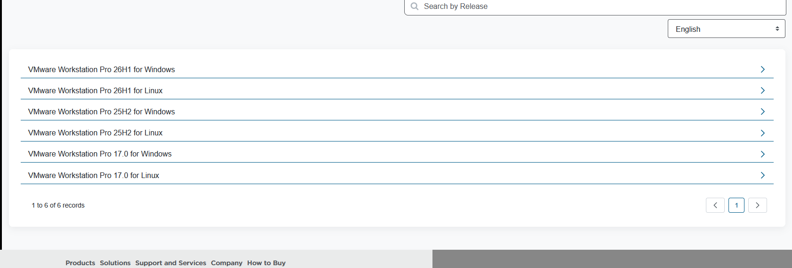
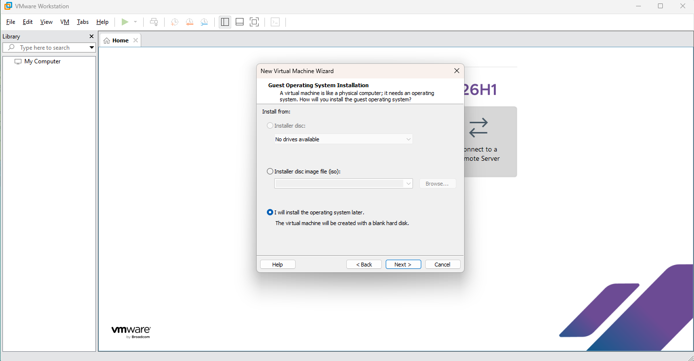
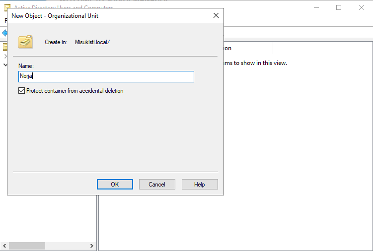

# Osa 1 - Perusta

 

## Esittely

Osa 1 rakennan projektin perustan luomalla virtuaaliympäristön, asentamalla Windows Serverin sekä ottamalla käyttöön Active Directoryn Domain Servicen.

Osion aikana:

- luodaan ja määritetään Windows Server -virtuaalikone
- asennetaan Active Directory ja luodaan toimialue
- rakennetaan ensimmäinen OU-rakenne
- luodaan käyttäjiä ja ryhmiä Active Directoryyn
- tutustutaan käyttäjähallinnan perusteisiin

 

## Virtuaaliympäristön käyttöönotto

Tässä osiossa valmistelen Active Directory -labraa varten tarvittavan virtuaaliympäristön. Käyn läpi VMware Workstation Pron asennuksen, Windows Server -asennusmedian lataamisen, virtuaalikoneen luonnin sekä käyttöjärjestelmän asennuksen.

 

### VMwaren Workstationin asennus

Ensimmäiseksi haasteekseni tuli selvittää mikä VMware Workstation versio olisi minulle sopiva ja onko erot huomattavia esimerkiksi yrityskäytössä. Päädyin valitsemaan uusimman VMware Workstation Pro 26H1-version, sillä se tarjoaa tuen uusimmille käyttöjärjestelmille ja sisältää useita suorituskykyyn sekä käytettävyyteen liittyviä parannuksia. Lisäksi versio on maksutta käytettävissä myös henkilökohtaiseen ja kaupalliseen käyttöön, joten se soveltuu erinomaisesti tämän laboratorion virtualisointialustaksi.

Itse asennus onnistui exe:n kautta kivuttomasti ilman ongelmia.

 

### Windows Server ISO lataus

Seuraavaksi latasin Windows Server 2022 Evaluation -ISO-tiedoston Microsoftin virallisilta sivuilta. Evaluation-versio soveltuu erinomaisesti laboratorioympäristöön, sillä se tarjoaa kaikki tarvittavat ominaisuudet Active Directoryn ja muiden palveluiden käyttöönottoon ilman erillistä lisenssiä.

 

### Virtuaalikoneen luonti

Käynnistin asentamani VMware Workstationin ja tein Windows Server virtuaalikoneen. Tällä kertaa päätin olla käyttämättä ISO-tiedostoa virtuaalikoneen luontivaiheessa, sillä aiemmissa projekteissani kyseinen menetelmä on aiheuttanut odottamattomia ongelmia asennuksen aikana. Loin VM:n ilman käyttöjärjestelmää ja määritin käyttöjärjestelmäkksi Windows Server 2022, jota vaastavan tiedoston latasimme aikaisemmassa vaiheessa.

Virtuaalikoneen ollessa valmis menin sen asetuksiin ja määrittelin manuaalisen reitin ISO tiedostolle virtuaaliseen CD/DVD-asemaan. Tämän jälkeen käynnistin koneen normaalisti valikosta jolloin asennus käynnistyi normaalisti ISO-tiedostolta.

 

### Windows Serverin asennus

Kun virtuaalikone käynnistetään, Windows Serverin asennus käynnistyy automaattisesti ISO-tiedostolta.

> **Huomio:** Käynnistyksen alussa näkyy kehote _"Press any key to boot from CD or DVD..."_. Jos näppäintä ei paineta ajoissa, asennus ei käynnisty, vaan virtuaalikone yrittää käynnistyä tyhjältä levyltä. Tällöin virtuaalikone on käynnistettävä uudelleen.

Asennusvaiheessa on tärkeää valita Windows Server 2022 Standard Evaluation (Desktop Experience), sillä kyseinen versio sisältää graafisen käyttöliittymän (GUI). Graafinen käyttöliittymä helpottaa Active Directoryn, DNS:n, DHCP:n ja muiden palveluiden hallintaa.

Kun järjestelmänvalvojan salasana oli määritetty ja käyttöjärjestelmä käynnistynyt, Windows Server oli valmis käyttöönotettavaksi. Tarkistin vielä Windver commandilla version jonka asensimme ja kaikki näytti olevan kunnossa.
  

## Active Directoryn asennus

Serveri toimii joten oli aika asentaa Active Directoryn projektiin ja määrittelin sille aloitusasetukset. Active Directoryn ideana on toimia keskeisenä hakemistopalveluna, jonka avulla voidaan hallita käyttäjiä, tietokoneita, ryhmiä ja käyttöoikeuksia keskitetysti.

 

### Active Directoryn asennus

Active Directory otetaan käyttöön Server Managerin kautta lisäämällä palvelimelle uusi rooli. Tässä vaiheessa valitsin asennettavaksi ainoastaan Active Directory Domain Services (AD DS)-roolin, sillä se on tämän projektin seuraavan vaiheen kannalta ainoa välttämätön komponentti.

Windows Serveriin voidaan lisätä uusia rooleja ja ominaisuuksia myös myöhemmin, joten DNS- ja DHCP Server -roolit asennetaan vasta niiden omissa laboratorio-osioissaan. Näin projekti etenee vaiheittain ja jokainen palvelu voidaan ottaa käyttöön sekä dokumentoida erikseen.

> **Huomio:** Muista seuraavassa "Feature" osiossa tarkistaa että Group Policy Management on ruksittu. Ilman tätä ominaisuutta et voi määrittää käyttäjille keskitetysti asetuksia.

 

### Määrittele toimialue ja korota se toimialueen ohjaimeksi

Koska kyseessä on laboratorion ensimmäinen palvelin, sille ei ole vielä määritetty toimialuetta (Domain) eikä se toimi vielä toimialueen ohjaimena (Domain Controller).

Tämän vuoksi Active Directory Domain Services -roolin asentamisen jälkeen palvelin on korotettava toimialueen ohjaimeksi valitsemalla "Promote this server to a domain controller". Tässä vaiheessa luodaan uusi toimialue, määritetään sen nimi sekä viimeistellään Active Directoryn käyttöönotto.

Domain nimeen olisi hyvä lisätä yrityksen domain mutta koska tämä on labraprojekti niin yleisin tapa on lisätä nimen perään ".local". Tässä tapauksessa nimesin domainini misukisti.local.

Kun kaikki asetukset oli määritetty, Active Directoryn käyttöönotto käynnistettiin. Asennuksen valmistuttua palvelin käynnistyi automaattisesti uudelleen, minkä jälkeen se toimi laboratorion ensimmäisenä toimialueen ohjaimena (Domain Controller).

  

## Active Directoryn käyttö

Ensimmäisenä vaiheena Active Directory -ympäristössä luodaan organisaation tarpeita vastaava OU-rakenne (Organizational Unit). OU:t toimivat Active Directoryn sisäisenä rakenteena, jonka avulla käyttäjiä, tietokoneita, ryhmiä ja muita objekteja voidaan järjestellä sekä hallita keskitetysti.

 

### OU luominen

Tässä laboratorioympäristössä loin yritykselle oman OU-rakenteen, jonka alle sijoitetaan kaikki kyseiseen ympäristöön liittyvät Active Directory -objektit. Selkeä rakenne helpottaa myöhemmin käyttöoikeuksien hallintaa sekä Group Policy -asetusten kohdistamista eri käyttäjä- ja tietokoneryhmille.

Active Directoryn käyttöönoton jälkeen avasin hallintatyökaluista Active Directory Users and Computers -työkalun. Sen avulla voidaan hallita toimialueen käyttäjiä, ryhmiä, tietokoneita sekä Organizational Unit (OU) -rakenteita.

Ensimmäisenä vaiheena loin laboratorioympäristöön organisaation mukaisen OU-rakenteen. Luomalla erilliset OU:t eri yksiköille voidaan myöhemmin hallita käyttöoikeuksia sekä kohdistaa Group Policy -asetuksia yksikkökohtaisesti.

Tässä projektissa loin kolme maakohtaista OU:ta:

- Suomi
- Ruotsi
- Norja

OU:t luotiin valitsemalla toimialue (misukisti.local) ja lisäämällä sen alle uudet Organizational Unit -säiliöt.

OU:ita voi olla myös OU:in sisällä ja on yleensä suositeltu tapa toimia joten loin rakenteen jossa jokaisella keskuksella on sama rakenne.

 

### Active Directory -ryhmien luominen

Seuraavassa vaiheessa loin Active Directoryyn ryhmiä eri organisaatioyksiköille. Samalla tutustuin eri ryhmätyyppeihin ja niiden käyttötarkoituksiin.

Active Directory sisältää kaksi pääasiallista ryhmätyyppiä:

- **Security Group** – käytetään käyttöoikeuksien hallintaan ja resurssien suojaamiseen.
- **Distribution Group** – käytetään lähinnä sähköpostijakeluihin eikä sitä voi käyttää käyttöoikeuksien määrittämiseen.

Nimesin projektiin **Security Groupin** "IT", koska tarkoituksena on myöhemmin testata käyttöoikeuksien hallintaa esimerkiksi tiedostopalvelimen ja muiden resurssien kanssa.
Ja **Distribution Groupin** "DL-ITAdmins", koska tarkoitukseni on myöhemmin testata sähköpostilistojen tekemistä.

Lisäksi tutustuin eri ryhmäalueisiin (**Group Scope**):

- **Global** – tarkoitettu yleensä saman toimialueen käyttäjien ja ryhmien kokoamiseen esimerkiksi osastoittain.
- **Domain Local** – käytetään usein resurssien käyttöoikeuksien määrittämiseen.
- **Universal** – tarkoitettu laajempiin ympäristöihin, joissa on useita toimialueita.

Tässä laboratorioympäristössä hyödynnän Global-ryhmiä käyttäjien organisointiin ja myöhemmissä vaiheissa testaan niiden yhdistämistä käyttöoikeuksien hallintaan.

 

### Active Directory -käyttäjien luominen

Uuden käyttäjän luominen tapahtuu samalla periaatteella kuin muidenkin Active Directory -objektien luominen OU-rakenteeseen. New > User. Sitten tiedot ylös ja vola!

