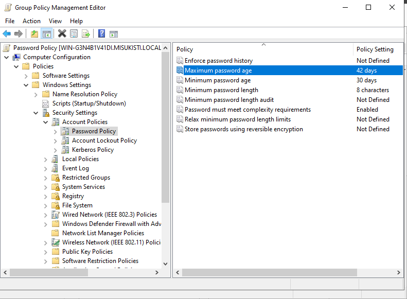
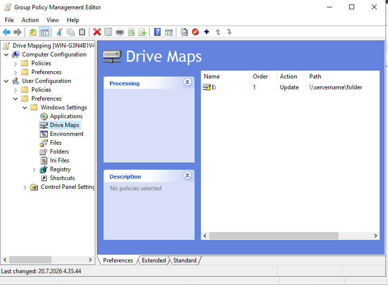
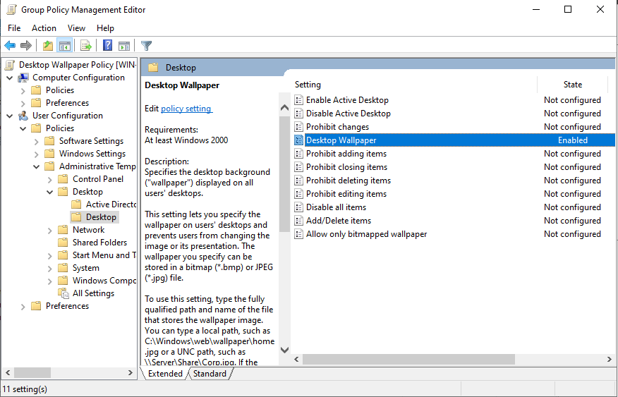
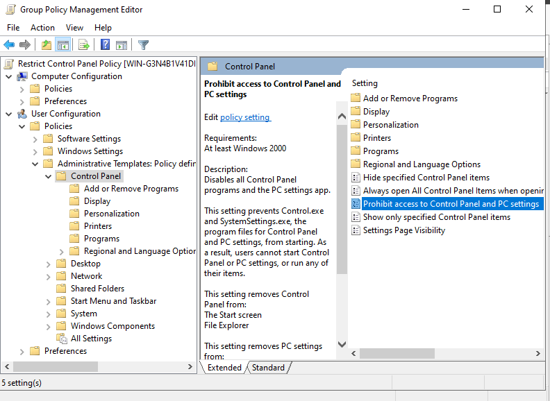

## Osa 2 - Ryhmäkäytäntöjen (GPO) määrittäminen

 

## Esittely

Projektin seuraavassa vaiheessa otettiin käyttöön Group Policy Management, jonne luotiin käytäntöjä, jotka otettiin käyttöön osassa 3.

 

### Luodaan ryhmäkäytäntö objekti

Oman domainin alta löytyi Default Domain Policy, jonka editoriin pääsi klikkaamalla oikealla hiirellä ja painamalla Edit. Tämän jälkeen avautui Group Policy Management Editor, jonka avulla voitiin määrittää toimialueelle kohdistettavia käytäntöjä (Policies).

Ennen käytäntöjen luomista tutustuin kuitenkin käytäntöryhmien tyyppeihin, jotta oikeanlaisten käytäntöjen laatiminen olisi mutkattomampaa.

- Tietokoneen kokoonpano (**Computer Configuration**) - Käytetään vain tietokoneen määrittelyyn riippumatta käyttäjästä
- Käyttäjän kokoonpano (**User Configuration**) - Käytetään vain käyttäjien määrittelyyn tietokoneeta riippumatta

Erilaiset tyyppiasetukset:
-Käytännöt (**Policies**) -Ovat asetuksia joita normaali käyttäjä ei pysty muuttamaan. Esim "Estä USB-muistitikut" tai "Pakota salasanan pituus".
-Suositusasetus (**Preferences**) - Ovat ns oletusasetuksia joita käyttäjä voi halutessaan muuttaa. Esim "Työpöydän taustakuva" tai "Luo verkkolevy"

 

### Harjoitus 1: Salasanakäytäntö

Pakotetaan käyttäjä valitsemaan vahva salasana tietoturvan vahvistamiseksi.

Oman domainin alle luotiin uusi GPO, joka nimettiin Password Policyksi. Avasin käytännön ja selasin oikeiden tabien läpi kohtaan Password Policy (kuva alla) ja säädin haluamani asetukset. Asetukset säädettiin Tietokoneen kokoonpanoon, sillä tietokone oli yksikkö, joka huolehti salasanoista.

Koin, että nykyisten standardien mukaisesti oli tärkeää, että salasana oli tarpeeksi pitkä, alkoi isolla kirjaimella, sisälsi erikoismerkkejä ja vanheni tietyn ajan jälkeen.

Tämän valmistuttua päätin jatkaa seuraavaan policyyn ja määrittelin käyttäjät ja groupit vasta GPO-määrittelyiden jälkeen.

 

### Harjoitus 2: Verkkolevyn liittäminen

Liitetään verkkolevyt käyttäjille heidän kirjautuessaan.

Oman domainin alle luotiin uusi GPO, joka nimettiin vaihtoehtoisesti Drive Mappingiksi. Nyt käytäntö määriteltiin käyttäjälle, sillä halusimme, että kirjautunut käyttäjä näki tietyt verkkolevyt. Halusimme myös, että käyttäjä pystyi myöhemmin muokkaamaan levyjä haluamallaan tavalla, joten määrittely tehtiin suositusasetuksiin (Preferences).

Kun muokkasimme käytäntöä ja seikkailimme taas oikeiden tabien ohi (kuva), pääsimme hallitsemaan Drive Mappingia. Loimme uuden levyn nimeltä E: ja jatkoimme seuraavan käytännön luomiseen.

 

### Harjoitus 3: Työpöydän taustakuvan käytäntö

Asetetaan työpöydälle default taustakuva.

Oman domainin alle luotiin uusi GPO, joka nimettiin Desktop Wallpaper Policyksi. Käytäntö määriteltiin käyttäjälle, sillä halusin nähdä taustakuvan aina käyttäjän kirjautuessa sisään. En myöskään halunnut, että käyttäjä pystyi vaihtamaan taustakuvaa, joten määrittely tehtiin käytäntöihin (Policies).

Oli taas aika seikkailla tabien läpi ja ottaa taustakuvakäytäntö käyttöön kohdasta Desktop Wallpaper. Kaikki meni hyvin ja voitiin jatkaa. Tässä kohtaa määrittely oli jo melko helppoa ja toistot selkeyttivät käytäntöjen luomista.

 

### Harjoitus 4: Rajoita pääsyä ohjauspaneeliin

Rajoitetaan käyttäjiä pääsemästä ohjauspaneeliin. Tämä ennaltaehkäisee laitevikoja sillä käyttäjä ei pääse itse säätämään asetuksia.

Oman domainin alle luotiin uusi GPO, joka nimettiin Restrict Control Panel Policyksi. Käytäntö määriteltiin käyttäjälle, sillä halusin, että nimenomaan vain tietyillä käyttäjillä oli evätyt oikeudet Control Paneliin. Emme myöskään halunneet, että käyttäjä pystyi muokkaamaan oikeuksiaan ohjauspaneeliin, joten määrittely tehtiin käytäntöihin (Policies).

Halusin pitää tämän harjoituksen lyhyenä, joten eväsin käyttäjältä kokonaan oikeudet ohjauspaneeliin, vaikka olisin voinut vain rajoittaa käyttöä. Tabien läpi vain oikeaan asetukseen (kuva alhaalla).

 

### Harjoitus 5: USB-muistilaitteiden käytön rajoittaminen

USB-muistilaitteiden käyttöä rajoitetaan usein yritysympäristöissä tietoturvan parantamiseksi.

Oman domainin alle loin uuden GPO, joka nimettiin Disable USB Devices Policyksi. Käytäntö määriteltiin tietokoneelle, sillä laite kytkettiin suoraan tietokoneeseen. Tietoturvasyistä emme halunneet, että käyttäjä pystyi muuttamaan käytäntöä, joten määrittely tehtiin käytäntöihin (Policies).

Tämän navigointi oli hieman haastavampaa, sillä Systems-kohdassa oli paljon selattavaa eikä mikään viitannut USB:hen, joten käytin Googlea apuna. Löysin viimein kohdan "Removable Storage Access" ja sieltä "All Removable Storage Classes: Deny All Access". Hyväksyin asetuksen ja olin tämän osion osalta valmis.

 

## Mitä opin?

- Ymmärsin Group Policy Managementin roolin Active Directory -ympäristön keskitettynä hallintatyökaluna.
- Opin erottamaan tietokone- ja käyttäjäkohtaiset käytännöt sekä valitsemaan oikean määrityspaikan käyttötarkoituksen mukaan.
- Opin eron Policies- ja Preferences-asetusten välillä sekä niiden käyttökohteet.
- Harjoittelin ryhmäkäytäntöobjektien (GPO) luomista, muokkaamista ja hallintaa.
- Toteutin useita yritysympäristöissä yleisesti käytettäviä ryhmäkäytäntöjä, kuten salasanakäytännön, verkkolevyn liittämisen, työpöydän taustakuvan määrittämisen, Ohjauspaneelin käytön rajoittamisen sekä USB-muistilaitteiden estämisen.

 
