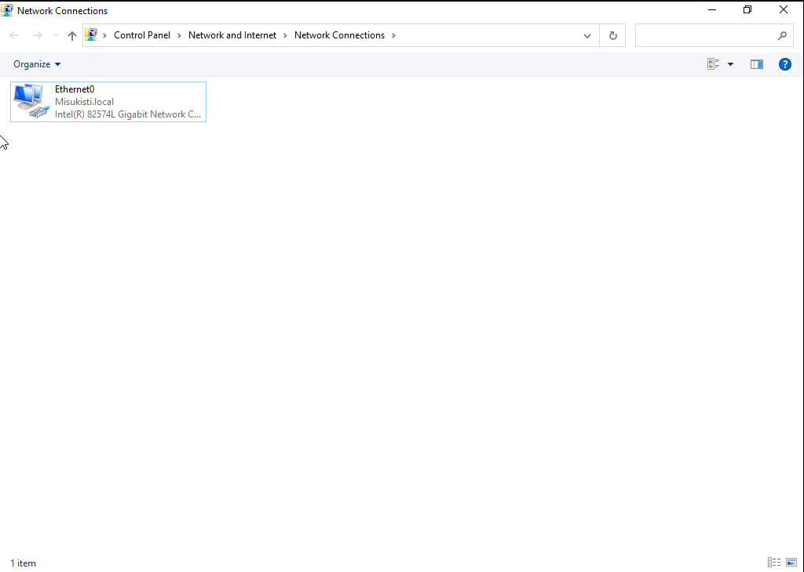
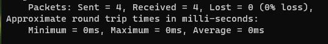
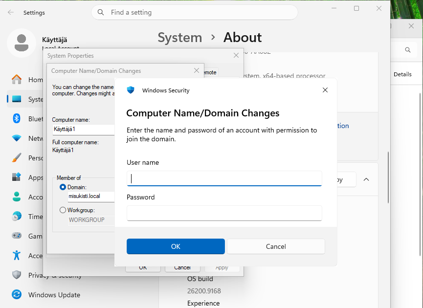
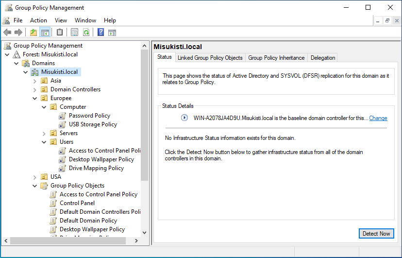
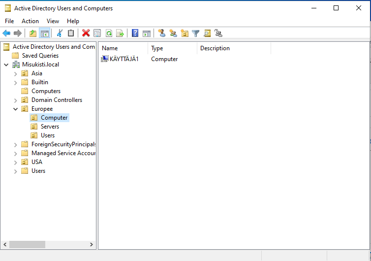

## Osa 3 - Käyttäjähallinta

 

## Esittely

Projekti oli edennyt siihen vaiheeseen, että toimialueelle voitiin alkaa luoda käyttäjiä ja ryhmiä sekä määrittää niille käyttöoikeuksia ja ryhmäkäytäntöjä. Tässä osiossa keskityttiin käyttäjähallinnan perusteisiin sekä Active Directoryn käyttöoikeuksien hallintaan.

### VM luominen projektiin

Loin Virtuaali koneen, jolle voin Konfiguroida luomiamme GPO:ita. En aijo käydä yksityiskohtaisesti läpi miten loin virtuaalikoneen, sillä sen periaate on sama kuin osa-1 luomamme windows-serveri. Latasin kokeiluversion windows-11 ISO tiedoston ja boottasin sen virtuaalikoneen CD-asemalta sekä eurasin ruudulle ilmestyviä asennusohjeita. On tärkeää että Windows versio on joko Pro tai Enterprise versio sillä vain näissä Windows versioissa on mahdollisuus liittyä domainiin.

### Serverin konfigurointi

Määritin palvelimelle staattisen IP-osoitteen sillä näin varmistutaan että laitteet pystyvät saumattomasti yhdistämään serveriin. Projektin sujuvuuden varmistamiseksi käytin IP-osoitetta, jonka ISP oli minulle määrittänyt. Lisäsin myös vaihtoehtoiseen DNS osoite kohtaan googlen oman osoitteen 8.8.8.8.

Konfigurointi tehtiin Windows Serverin Network Connections -asetuksista. Avasin verkkoyhteyden ominaisuudet (Properties) ja valitsin Internet Protocol Version 4 (TCP/IPv4) -asetukset.

Tarkistin kaiken konfiguroimani vielä Windowsin komentorivillä ipconfig /all ja kaikki näytti miltä pitääkin.

### Koneen lisäys domainiin

Määritin Windows-työasemalle verkkoyhteyden asetuksista staattisen DNS-palvelimen osoitteen. Asetin DNS-palvelimeksi Windows Serverin IP-osoitteen, jotta työasema käyttää organisaation omaa DNS-palvelinta. Tämän jälkeen työasema pystyi löytämään Active Directory -domainin ja liittymään siihen.

Testasin verkkoyhteyden toimivuuden Windowsin komentorivillä käyttämällä ping-komentoa. Ping-testit onnistuivat, joten työaseman ja Windows Serverin välinen verkkoyhteys sekä DNS toimivat odotetulla tavalla.

Suuntasin käyttäjäasetuksiin ja sieltä **domain** jossa määritin tietokoneen käyttämään aiemmin luomaani paikallista domainia. Painettuani OK Windows pyysi domainin käyttäjätunnuksia ja salasanaa. Tämä osoittaa, että työasema on saanut yhteyden määrittelemääni domainiin ja pystyy tunnistamaan domainin.

Kun kone oli määritelty domainiin käynnistin koneen uudelleen. Kirjautumisruudussa valitsin Toisen käyttäjän ja nyt ruudulla lukee onnistuneesti Domainini nimi **Misukisti**.

### Group Policyjen käyttöönotto

Nyt Serverillä **Group Policy Managerissa** linkitin policyja **Group Policy Objektista** vetämällä ne oikeisiin OU:hin (Users, Computers).

Jotta GPO:t toimivat kyseisessä koneessa on kone assetti siirrettävä oikealle OU:lle. Tässä tapauksessa määrittelemälleni Europe ja sen Computer. Tämä tapahtui käyttämällä move toimintoa ja siirtämällä se valittuun OU:hin.

### Mitä ongelmia kohtasin ja miten ratkoin sen

- Vaikka sainkin VM asennuksen kuulostamaan helpolta kohtasin kuitenkin ongelman ISO-tiedoston kanssa. Olin huomaamattani onnistunut lataamaan ARM64-arkkitehtuurille tarkoitetun tiedoston eikä tästä syystä VM suostunut boottaamaan latausta. Hetken forumeita tutkittuani löysin ongelman ja latasin oikean iso tiedoston x64-arkkitehtuuriin sopivaksi.
- En saanut GPO:ta toimimaan käyttäjällä ja muokkauksien jälkeen mikään ei näyttänyt toimivan. Tajusin että Policyt eivät päivity realiajassa ja ne pitää ajaa manuaalisesti sisään jos haluaa nähdä tulokset realiajassa **gpupdate /force**
