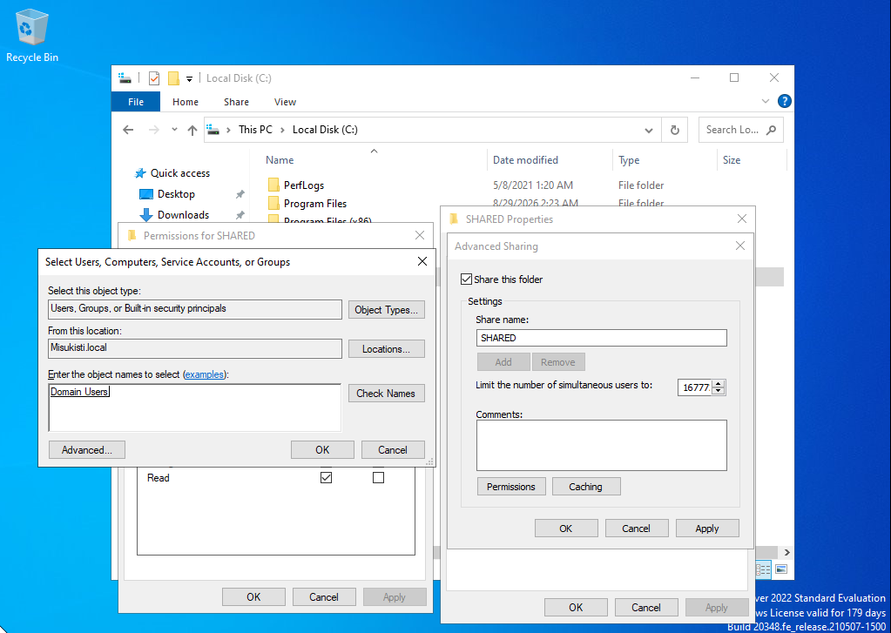
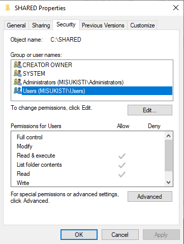
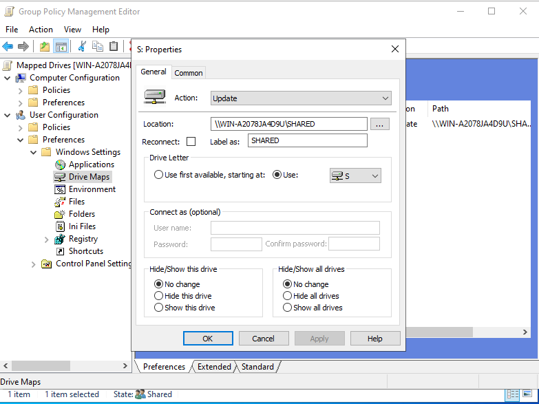
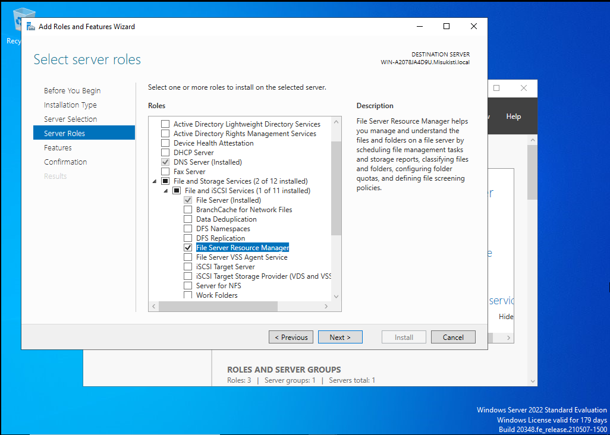
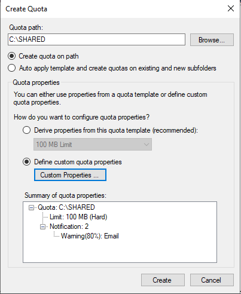
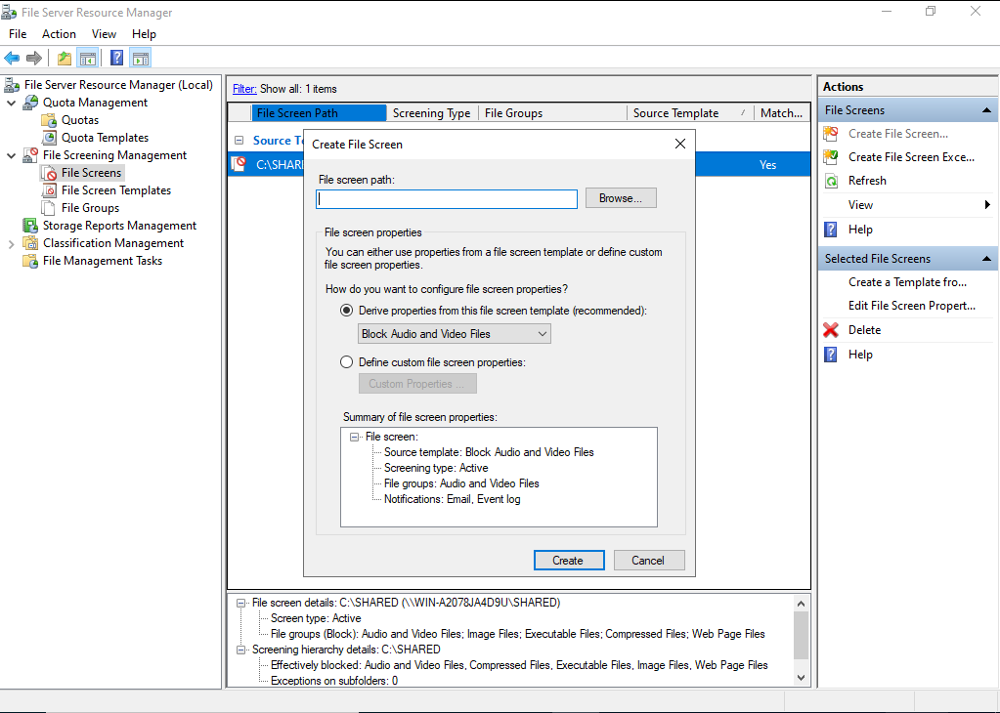

# Osa 4 - Tiedostojen jakaminen

 

## Esittely

Tässä osiossa määrittelin keille tietyt tiedostot näkyvät. Osiossa tutustuttiin Verkon sekä paikallisen tiedostojen jakamisen toimintaan.

 

### Tiedostojen jakamisen valmistelut

Loin local disk C:n juureen kansion "SHARED" jolle määrittelin oikeudet. Haluan määritellä myöhemmin tarkempia oikeuksia kansioiden sisällä tiettyihin tiedostoihin johon yleinen oikeus ei ole pätevä vaan joudun käyttämään NTSF ominaisuutta jolla pystyy piilottamaan tiedostoja käyttäjiltä.

Menin kansion asetuksiin (**properties**) ja sieltä **Sharing**. Nyt pystyin määritellä kelle kansio jaetaan ja valitsin kaikille domain käyttäjille **Domain Users**

Jos haluan käyttää NTSF (New Technology File System) ominaisuutta suuntaisin asetuksissa (**properties**) kohtaan Security ja säätäisin haluamani Groupit sieltä. Tässä esimerkissä kuitenkin käytin aikasempaa Sharing ominaisuutta ja pidin tämän simppelinä.

 

### Verkkoasemien kartoittaminen kartoittamalla (mapping)

Windows koneella jonka lisäsimme eilen domainiimme navigoin tiedostoissa **This PC** ja oikealla klikillä kohtaan **Map network folder**. Se kysyy folderin nimeä johon pistin serverini nimen ja kansion jonka halusin jakaa (\\WindowsServer\kansion nimi). Windows serverin sain kirjoittamalla serverin komentoriville hostname.

Kartoittaminen tällä tavalla on huono tapa yritysympäristössä, sillä se tulee tehdä jokaiselle käyttäjälle erikseen. Tämän lisäksi kansio häviää, joka kerta kun laite käynnistetään uudelleen. Tämä metodi sopii siis vain jos halutaan väliaikaisesti päästä kiinni tiedostoihin mutta ei pitkäaikasempaan käyttöön.

 

### Verkkoasemien määrittely GPO:iden avulla

Hoidin homman siis tutulla kaavalla vanhoista osioista. Loin uuden Group Policyn (Mapped Drives) ja muokkasin sitä.

Navigoin muokkaus näkymässä User -> Preference -> Drive maps ja loin sinne uuden verkkoaseman määrittelyn. Asetukset ovat lähes samat kuin kartoittamalla määrittelemäni. Location kohtaan asetin saman polun kuin edellisessä kohdassaa ja loin levyaseman S:.

Nyt viimeisenä määritelty GPO piti linkittää oikeaan kohtaan eli käyttäjille joihin haluan sen vaikuttavan. Homma oli tuttu viime osiosta jossa tehtiin käyttäjähallintaa. Käyttäjä pystyy nyt näkemään aina kansion vaikka kirjautuisikin koneelle uudestaan.

 

### Verkkoasemien määrittely FSRM:n (File Server Resource Manager) avulla

FSRM on resurssienhallinta työkalu, jonka avulla järjestelmänvalvoja voi hallita, valvoa ja rajoittaa tiedostopalvelimille tallennettavaa dataa.

 

Jotta voin ottaa FSRM:n käyttöön on palattava osa-1 oppeihin ja ladattava uusi ominaisuus serverille (feature). Eli navigoin takaisin server manager menuun ja sieltä **Add new feature**. Pidin kaiken samana kuin aikaisemmin määrittelemäni mutta nyt **Server Role** kohdasta valitsin resurssienhallinnan **File Server Resource Manager**. Nyt uusi hallintapaneeli oli valmis asennettavaksi.

Pystyin asennuksen jälkeen avaamaan File Server Resource Managerin. Halusin hallita kuinka paljon tilaa käyttäjät saisivat käyttöönsä sekä mitä dataa levyille pystyy tallentamaan. Ensimmäisenä vuorossa oli Quotan luominen joka vastaa siitä paljon dataa levylle voidaan tallentaa. Menin kohtaan Quotas ja edit. Sieltä määrittelin mistä kansiosta oli kyse ja Custom Propertiesista hallitsin levyn kokoa (10GB) sekä asetin että adminit saavat sähköpostin kun tila lähestyy 80%. Ensimmäinen Quotani oli valmistunut ongelmitta!

Quotan luomisen jälkeen File Screenin luominen ei ollut ongelma. File Screen on vastuussa mitä dataa levylle voidaan tallentaa ja itse prosessi toimi miltei samalla tavalla kuin edellisessä. Pystyin valitsemaan erikseen mitä halusin ja en halunnut tallennettavaksi levylle. Ei aikaakaan kun ensimmäinen File Screenskin oli valmis.

FSRM on yksityiskohtainen ja tehokas vaihtoehto yritysympäristöön. Sen avulla voidaan hallita ja valvoa tiedostopalvelimen käyttöä tarkasti sekä rajoittaa käyttäjistä johtuvia ongelmia yrityksen infrastruktuurissa. Näin voidaan vähentää inhimillisistä virheistä ja väärinkäytöksistä aiheutuvia riskejä.
