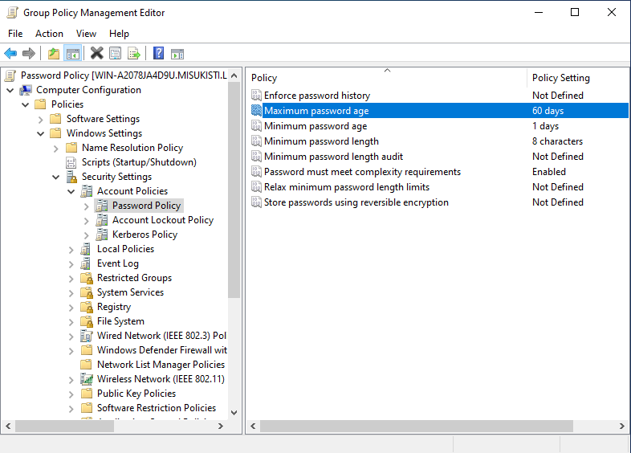
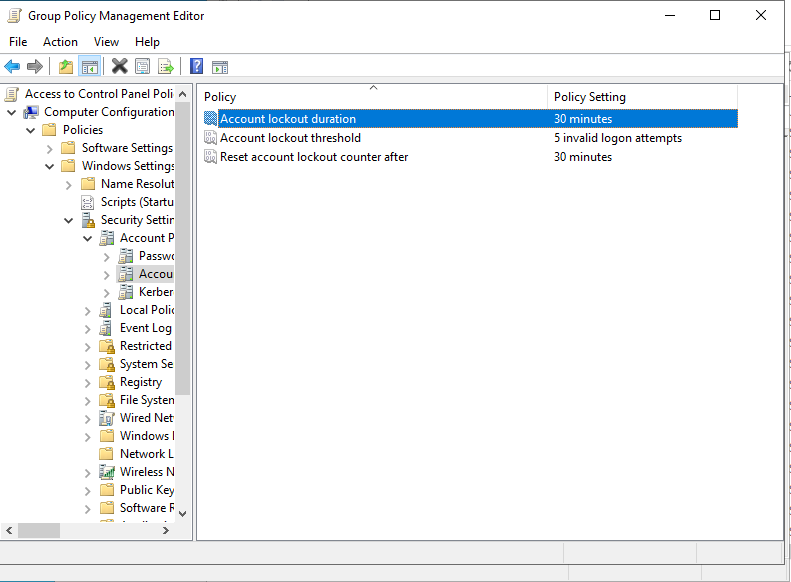
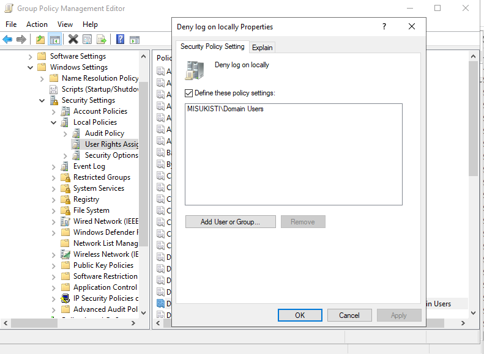
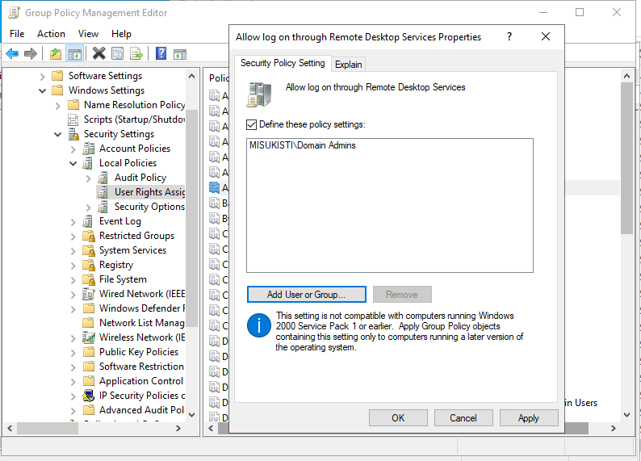

## Osa 5 - Tietoturvakäytäntöjen toteuttaminen

 

## Esittely

Kun olin saanut oman palvelinympäristöni rakennettua, halusin keskittyä sen sisäisen tietoturvan parantamiseen. Vaikka tässä osassa ei enää opeteltu mitään uutta liittyen Active Directoryyn, opin paljon siihen liittyvästä tietoturvasta. Tämä toteutettiin määrittämällä palvelinympäristöön erilaisia tietoturvakäytäntöjä, joiden avulla pyritään parantamaan ympäristön turvallisuutta ja vähentämään mahdollisia tietoturvariskejä.

 

### Salasana käytäntöjen luominen

Ensimmäisenä asiana halusin varmistaa että käyttäjät luovat itselleen vahvaa salasanaa. Tein aikaisemmassa osassa password policyn jota päätin muokata paremmaksi. Nyt keskityin siihen että salasanan pituus, vahvuus ja ikä oli määritelty standardien mukaisesti.

 

Valitsin asetuksiksi 8 merkkiä, vahvan salasanan ja 60 päivän pituisen salasanan. Jos haluaa varmistua vielä vahvemmmasta salasanasta on hyvä muuttaa tua 8 merkkiä isommaksi esim 12, mutta en kokenut sitä nyt tarpeelliseksi.

Testasin tekemääni käytäntöä lisäämällä uuden käyttäjän domainiin ja kaikki toimii niin kuin pitää.

 

### Käyttäjän lukitseminen väsytyshyökkäyksen (Brute-force) ehkäisemiseksi

Halusin GOP:n joka suojaa minut Brute-forcea vastaan. Brute-force on kyberturvallisuuteen liittyvä termi joka tarkoittaa hyökkäystä jossa ulkopuolinen tekijä yrittää päästä kirjautumaan käyttäjälle yrittäen systemaattisesti kaikkia mahdollisia salasanoja. Voimme ehkäistä tätä luomalla GPO:n joka lukitsee käyttäjän liian monen väärän salasanan jälkeen.

 

En käy enää läpi miten loin uuden GPO:n sillä olemme toistaneet saman jo monesti edellisissä osissa. Valitsin managerista account policyn ja sieltä säädin asetuksia **Account lockout duration** (30min), **Account lockout threshold** (5 invalid logon attempts) sekä **Reset account lockout counter after** (30min). Asetukset voivat muuttua yrityksen omien käytäntöjen mukaan mutta nämä asetukset riittävät minulle.

### Käyttäjien oikeudet

Tietoturvan kannalta on tärkeää rajoittaa peruskäyttäjien oikeuksia. Peruskäyttäjällä ei välttämättä ole riittävää tietämystä tai kokemusta tietoturvallisesta tietokoneen käytöstä, joten liian laajat käyttöoikeudet voivat aiheuttaa tarpeettomia riskejä.

 

Lisäksi rajoittamalla käyttäjien oikeuksia esimerkiksi etäyhteyksien muodostamiseen voidaan ennaltaehkäistä mahdollisia tietoturvariskejä ja estää luvattomia yhteyksiä järjestelmään.

 

Päätin tässä labissa keskittyä käyttäjien etäyhteyksien estämiseen, sillä se on yksi konkreettinen tapa parantaa ympäristön tietoturvaa. Samassa näkymässä on kuitenkin paljon muitakin käyttäjien ja järjestelmän toimintaa rajoittavia konfiguraatioita. Niihin kannattaa tutustua tarkemmin, jotta yrityksen ympäristöön voidaan määrittää juuri sen tarpeisiin sopivat tietoturvakäytännöt.

 

 

### Mitä ongelmia kohtasin ja miten ratkoin sen

-En voinut yhdistää etänä konetta vaikka olikin oikeudet. Huomasin että server managerista minulla oli remote access pois päältä. Laitoin sen päällee ja nyt GOP konfiguraatiot toimivat kuten halusin.

 
