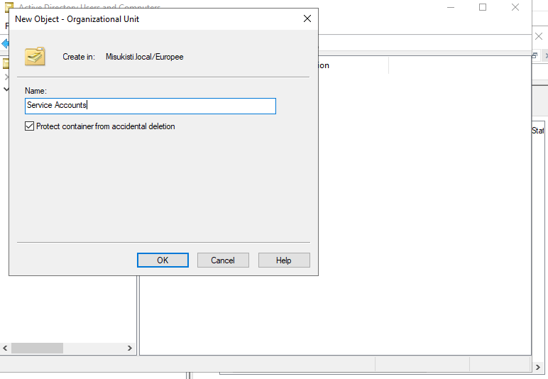
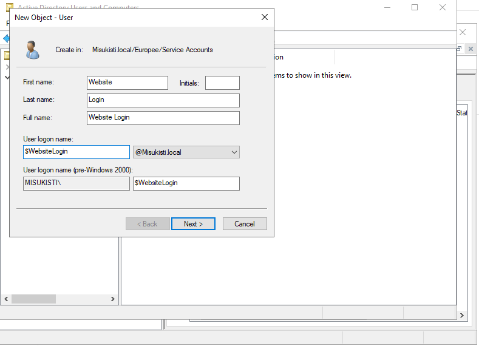
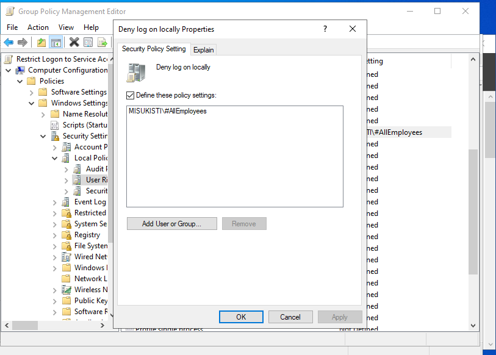

## Osa 6 - Palvelutili

 

## Esittely

Palvelutiliä käytetään palveluiden, sovellusten ja automaattisten tehtävien suorittamiseen ilman, että niiden tarvitsee käyttää henkilökohtaista käyttäjätiliä. Palvelutilille voidaan määrittää vain ne käyttöoikeudet, joita palvelu tarvitsee toimiakseen. Näin voidaan noudattaa vähimpien oikeuksien periaatetta ja parantaa ympäristön tietoturvaa. Tässä osiossa loin palvelutilin ja tutustuin sen käyttötarkoitukseen sekä käyttöoikeuksien määrittämiseen Active Directory -ympäristössä.

### Kiosk

Vaikka kiosk-tilaa ei käytetty tässä harjoituksessa, halusin tutustua myös sen käyttötarkoitukseen. Kiosk-tilassa tietokone voidaan määrittää suorittamaan vain tiettyä sovellusta tai rajoitettua määrää toimintoja. Tätä voidaan hyödyntää esimerkiksi yritysten asiakaspalvelupisteissä, infonäytöissä tai muissa tilanteissa, joissa käyttäjälle ei haluta antaa pääsyä tietokoneen kaikkiin toimintoihin.

 

Kiosk törmää yleensä julkisissa palveluissa kuten kirjastoissa ja palvelutiskeillä.

 

### Service Account

Ensimmäisenä tehtävänä loin OU:in Service Accounteille, jotta serverin rakenne pysyisi mahdollisimman selkeänä ja sille voidaan myöhemmin kofiguroida omia käytäntöjä.

Loin OU:n sisälle oman käyttäjän. On tärkeää antaa käyttäjän logon nimelle jokin symboli jotta se pystytään helposti filtteröimään kun käyttäjiä on useita. Tässä tapauksessa käytin "$".

 

Jotta voin käyttää autologin ominaisuutta latasin sysinternals suite työkalupaketin jossa oli mukana autologin ominaisuus. Painoin **Autologon.exe:ä** ja syötin uuden luomani accountin tiedot.

 

Kun kirjautuminen on tehty pystyin testaamaan toimivuutta käynnistämällä koneen uudestaan. Jos kone kirjautuu käyttäjälle automaattisesti konfiguraatio on onnistunut odotetusti.

 

Halusin että käyttäjä näkee heti googlen kun kone käynnistyy joten määrittelin microsoft edgestä aloitus ikkunaksi googlen ja käynnistyksen heti kun windowsille kirjaudutaan.
Lisäsin edgen exe tiedoston Startup kansioon jotta se käynnistyy aina startupin yhteydessä.

 

Lopuksi totuttuun tapaan tein käyttäjälle oman GPO:n joka estää ulkopuolelta kirjautumisen serverin koneilta. Sitä varten loin Groupin **AllEmployees**.

 
