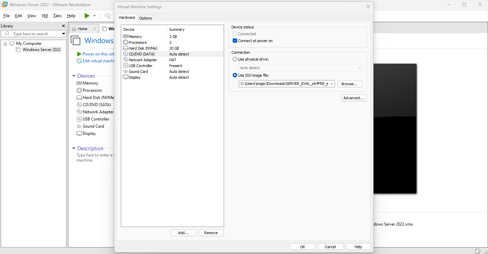
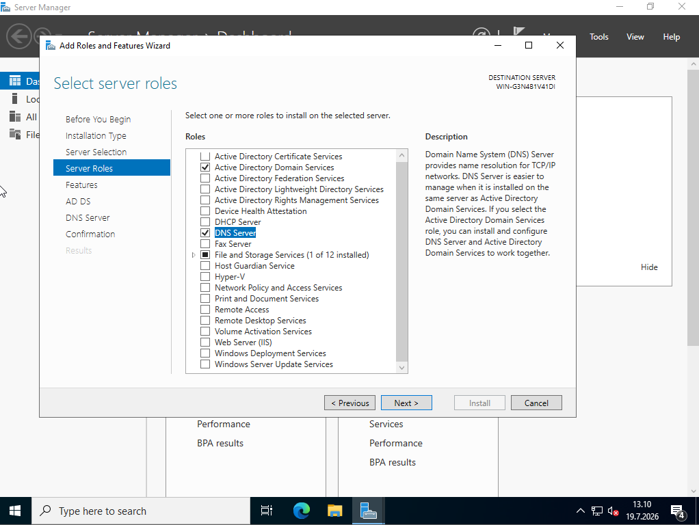

# ACTIVE DIRECTORY

 

## Esittely

Haluan aloittaa Enterprise Systems Lab -projektini nimenomaan Active Directoryn parissa, sillä se on yksi yritysympäristöjen keskeisimmistä identiteetin- ja käyttäjähallintajärjestelmistä. Active Directory on edelleen laajasti käytössä organisaatioissa, joten sen käytännön osaaminen on tärkeä taito järjestelmäasiantuntijan, IT-tuen ja infrastruktuuritehtävien näkökulmasta.

Projektissa tulen tekemään alusta alkaen toimivan Windows Server -ympäristön, johon toteutan Active Directory Domain Services -palvelun sekä siihen liittyvät keskeiset palvelut, kuten DNS:n, DHCP:n, käyttäjä- ja ryhmähallinnan, Group Policy -käytännöt, tiedostojen jaot sekä Windows-asiakaskoneen liittämisen toimialueeseen. ja dokumentoin koko projektin virheitä myöten tähän.

Dokumentoin projektin vaihe vaiheelta GitHubiin, mukaan lukien arkkitehtuurin, käyttöönoton, kohtaamani haasteet sekä niiden ratkaisut. Tavoitteena on oppia käytännön järjestelmähallintaa ja rakentaa samalla portfolio, joka kuvastaa osaamistani yritysympäristöjen ylläpidossa.

 

## Virtuaaliympäristön käyttöönotto

Tässä osiossa valmistelen Active Directory -labraa varten tarvittavan virtuaaliympäristön. Käyn läpi VMware Workstation Pron asennuksen, Windows Server -asennusmedian lataamisen, virtuaalikoneen luonnin sekä käyttöjärjestelmän asennuksen.

 

### VMwaren Workstationin asennus

Ensimmäiseksi haasteekseni tuli selvittää mikä VMware Workstation versio olisi minulle sopiva ja onko erot huomattavia esimerkiksi yrityskäytössä. Päädyin valitsemaan uusimman VMware Workstation Pro 26H1-version, sillä se tarjoaa tuen uusimmille käyttöjärjestelmille ja sisältää useita suorituskykyyn sekä käytettävyyteen liittyviä parannuksia. Lisäksi versio on maksutta käytettävissä myös henkilökohtaiseen ja kaupalliseen käyttöön, joten se soveltuu erinomaisesti tämän laboratorion virtualisointialustaksi.

Itse asennus onnistui exe:n kautta kivuttomasti ilman ongelmia.

 

### Windows Server ISO lataus

Seuraavaksi latasin Windows Server 2022 Evaluation -ISO-tiedoston Microsoftin virallisilta sivuilta. Evaluation-versio soveltuu erinomaisesti laboratorioympäristöön, sillä se tarjoaa kaikki tarvittavat ominaisuudet Active Directoryn ja muiden palveluiden käyttöönottoon ilman erillistä lisenssiä.

 

### Virtuaalikoneen luonti

Käynnistin asentamani VMware Workstationin ja tein Windows Server virtuaalikoneen. Tällä kertaa päätin olla käyttämättä ISO-tiedostoa virtuaalikoneen luontivaiheessa, sillä aiemmissa projekteissani kyseinen menetelmä on aiheuttanut odottamattomia ongelmia asennuksen aikana. Loin VM:n ilman käyttöjärjestelmää ja määritin käyttöjärjestelmäkksi Windows Server 2022, jota vaastavan tiedoston latasimme aikaisemmassa vaiheessa.

Virtuaalikoneen ollessa valmis menin sen asetuksiin ja määrittelin manuaalisen reitin ISO tiedostolle virtuaaliseen CD/DVD-asemaan. Tämän jälkeen käynnistin koneen normaalisti valikosta jolloin asennus käynnistyi normaalisti ISO-tiedostolta.

 

### Windows Serverin asennus

Kun virtuaalikone käynnistetään, Windows Serverin asennus käynnistyy automaattisesti ISO-tiedostolta.

> **Huomio:** Käynnistyksen alussa näkyy kehote _"Press any key to boot from CD or DVD..."_. Jos näppäintä ei paineta ajoissa, asennus ei käynnisty, vaan virtuaalikone yrittää käynnistyä tyhjältä levyltä. Tällöin virtuaalikone on käynnistettävä uudelleen.

Asennusvaiheessa on tärkeää valita Windows Server 2022 Standard Evaluation (Desktop Experience), sillä kyseinen versio sisältää graafisen käyttöliittymän (GUI). Graafinen käyttöliittymä helpottaa Active Directoryn, DNS:n, DHCP:n ja muiden palveluiden hallintaa.

Kun järjestelmänvalvojan salasana oli määritetty ja käyttöjärjestelmä käynnistynyt, Windows Server oli valmis käyttöönotettavaksi. Tarkistin vielä Windver commandilla version jonka asensimme ja kaikki näytti olevan kunnossa.
 

## Active Directoryn asennus

Serveri toimii joten oli aika asentaa Active Directoryn projektiin ja määrittelin sille aloitusasetukset. Active Directoryn ideana on toimia keskeisenä hakemistopalveluna, jonka avulla voidaan hallita käyttäjiä, tietokoneita, ryhmiä ja käyttöoikeuksia keskitetysti.

 

### Active Directoryn asennus

Active Directory otetaan käyttöön Server Managerin kautta lisäämällä palvelimelle uusi rooli. Tässä vaiheessa valitsin asennettavaksi ainoastaan Active Directory Domain Services (AD DS)-roolin, sillä se on tämän projektin seuraavan vaiheen kannalta ainoa välttämätön komponentti.

Windows Serveriin voidaan lisätä uusia rooleja ja ominaisuuksia myös myöhemmin, joten DNS- ja DHCP Server -roolit asennetaan vasta niiden omissa laboratorio-osioissaan. Näin projekti etenee vaiheittain ja jokainen palvelu voidaan ottaa käyttöön sekä dokumentoida erikseen.

> **Huomio:** Muista seuraavassa "Feature" osiossa tarkistaa että Group Policy Management on ruksittu. Ilman tätä ominaisuutta et voi määrittää käyttäjille keskitetysti asetuksia.

 

### Määrittele toimialue ja korota se toimialueen ohjaimeksi

Koska kyseessä on laboratorion ensimmäinen palvelin, sille ei ole vielä määritetty toimialuetta (Domain) eikä se toimi vielä toimialueen ohjaimena (Domain Controller).

Tämän vuoksi Active Directory Domain Services -roolin asentamisen jälkeen palvelin on korotettava toimialueen ohjaimeksi valitsemalla "Promote this server to a domain controller". Tässä vaiheessa luodaan uusi toimialue, määritetään sen nimi sekä viimeistellään Active Directoryn käyttöönotto.

Domain nimeen olisi hyvä lisätä yrityksen domain mutta koska tämä on labraprojekti niin yleisin tapa on lisätä nimen perään ".local". Tässä tapauksessa nimesin domainini misukisti.local "

Kun kaikki asetukset oli määritetty, Active Directoryn käyttöönotto käynnistettiin. Asennuksen valmistuttua palvelin käynnistyi automaattisesti uudelleen, minkä jälkeen se toimi laboratorion ensimmäisenä toimialueen ohjaimena (Domain Controller).
