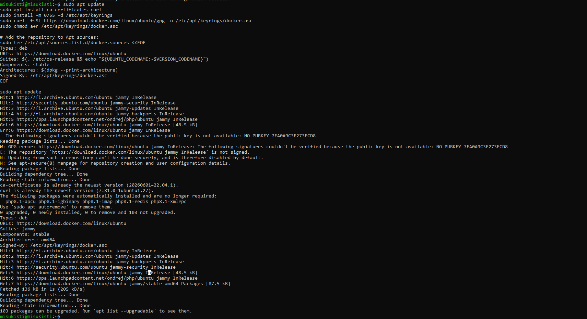
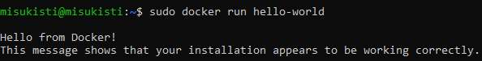

# Asennus Ubuntu serverille

 

## Esittely

Tässä osiossa asensin Dockerin GLPI-harjoituksesta tutulle Ubuntu serverille. Tavoitteena oli saada Docker-ympäristö toimimaan palvelimella ja varmistaa asennuksen onnistuminen testaamalla Dockerin toimintaa.

 

### Ubuntun version tarkastus

Ensimmäisenä tehtävänäni tarkistin onko käyttöjärjestelmäni dockeriin sopiva. Tarkistin dockerin ohjekirjasta version ja ajoin palvelimellani komennon cat /etc/ release ja tarkistin sopivuuden. Tarkistin myös onko minulla 64 bittistä versiota käyttöjärjestälmästäni (dpkg --print-architecture). Kaikki näytti hyvältä joten siirryin varsinaiseen asennus vaiheeseen.

**Huom**: jos serverille on joskus asennettu docker on hyvä poistaa vanhat tiedostot ennen dockerin varsinaista asennusta. En tehnyt tätä vaihetta sillä en ole koskaan ladannut dockeria tälle virtuaalikoneelle.

 

### Dockerin APT-repositorion käyttöönotto ja Dockerin asennus

Tässä vaiheessa lisäsin Dockerin virallisen ohjelmistolähteen Ubuntu Serverille. Latasin Dockerin GPG-avaimen pakettien aitouden varmistamista varten ja määritin APT:n käyttämään Dockerin vakaata ohjelmistolähdettä. Lopuksi päivitin pakettilistan, jotta Dockerin paketit olivat saatavilla asennusta varten.

Seuraavaksi asensin Docker Enginen Ubuntu Serverille. Docker Engine toimii Dockerin niin sanottuna moottorina, joka luo, käynnistää ja hallitsee kontteja (container).

Asensin Docker Enginen seuraavalla komennolla:

**sudo apt install docker-ce docker-ce-cli containerd.io docker-buildx-plugin docker-compose-plugin**

Asennus valmistui onnistuneesti. Halusin vielä varmistaa, että Docker-palvelu oli käynnissä. Tarkistin palvelun tilan komennolla **sudo systemctl status docker**, jonka avulla näin, että Docker oli aktiivinen ja käynnissä.

Varmistaakseni, että Dockerin asennus ja toiminta olivat kunnossa, suoritin vielä Dockerin hello-world-testin komennolla: **sudo docker run hello-world**. Komento lataa tarvittaessa hello-world-imagen Docker Hubista ja käynnistää siitä kontin. Testin onnistuminen varmisti, että Docker pystyi lataamaan imagen ja suorittamaan siitä kontin.

Asennus näytti onnistuvan ja kaikki näytti miltä pitikin.

 
