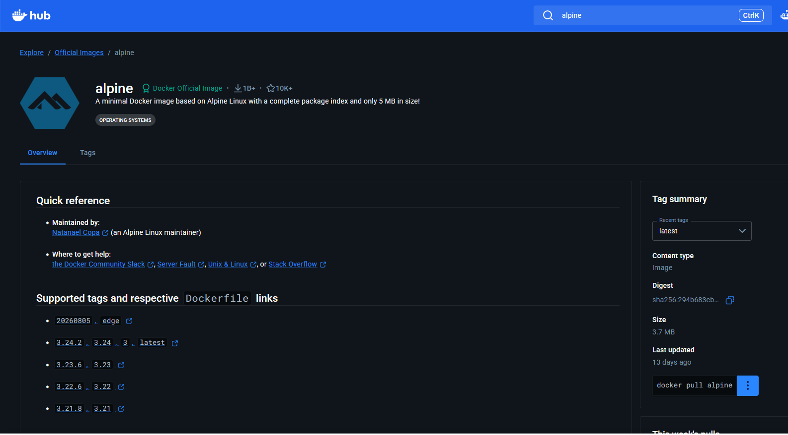
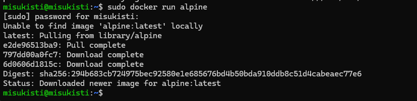
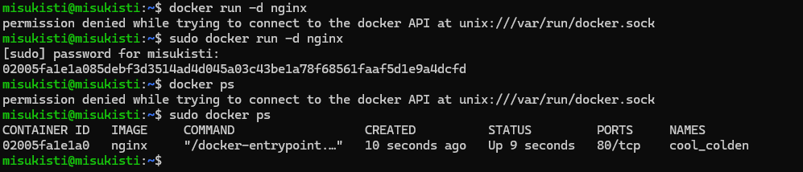

# Konttien ja kuvien ajaminen

 

## Esittely

Ajoin ensimmäisen Docker-konttini ja tutustuin Docker-kuvien (images) ajamiseen.

 

### Konttien luonti ja ajaminen.

Halusin kontin, joka ajaa Alpine Linuxia. Alpine Linux on kevyt Linux-distribuutio, jolla pystyy suorittamaan Linux-komentoja. Käynnistin siis kontin imagen pohjalta. Löydän imaget koottuna: https://hub.docker.com/.

Selvitettyäni imagen nimen ajoin kontin luonnin **docker run alpine** ja asenus onnistui.

Kontti suoritti sille määritellyn pääprosessin loppuun ja pysähtyi. Koska emme määritelleet kontille muuta toimintoa kuin run-komennon, kontti pysähtyi, kun Alpine Linuxin ajaminen oli suoritettu. Jos ajan esimerkiksi **docker run alpine sleep 10** huomaan miten se pysyy käynnissä 10s ennen kuin haluttu lopputulos saavutetaan ja kontti kääntyy pois päältä.

Latasin nyt nginx web-serverin samalla tavalla kun alpinenkin ja huomasin latauksen jälkeen web serverin toimivan taustalla. Tämä johtuu siitä että serveri jää kuuntelemaan HTTP-pyyntöjä jatkuvasti ja näin pääprosessi on siis edelleen käynnissä.

 

### Konttien ajaminen taustalla

Jotta voimme ajaa esimerkiksi ajaa web-serveriä komentorivillä ja jatkaa työskentelyä samalta komentoriviltä on meidän ajettava ohjelma ns "taustalla". Tämä onnistuu lisäämällä docker run komentoon -d "detached mode" (docker run -d [image])

Tutulla ps komennolla pystyin tarkastella käynnissä olevia kontteja.

Testatin nyt stop komentoa pysäyttääkseni kontin. Tähän käy kontin nimi tai id (Ilmeisesti kontin ID:stä voi käyttää lyhyempää tunnistetta, kunhan se on riittävän yksilöllinen.). Nyt lista on tyhjä ( docker ps) eikä käynnissä ole yhtään konttia.

 

### Konttien sekä kuvien poistaminen listasta

Kun tein komennon docker ps -a sain listan kaikista konteista jotka loin mutta ei ollut käytössä. Pystyn poistamaan haluamani kontit tekemällä **docker rm [name]** komennon jolloin kontti on poistettu onnistuneesti.

Sama tehtiin myös kuville (image) jotka sai esiin komennolla **docker images** ja listasta poistettua **docker rmi [name]**.

 

### Compose
