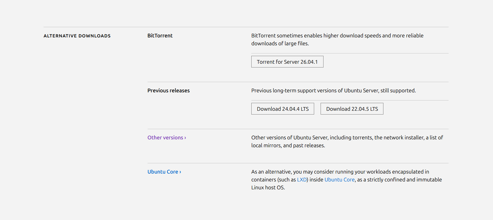
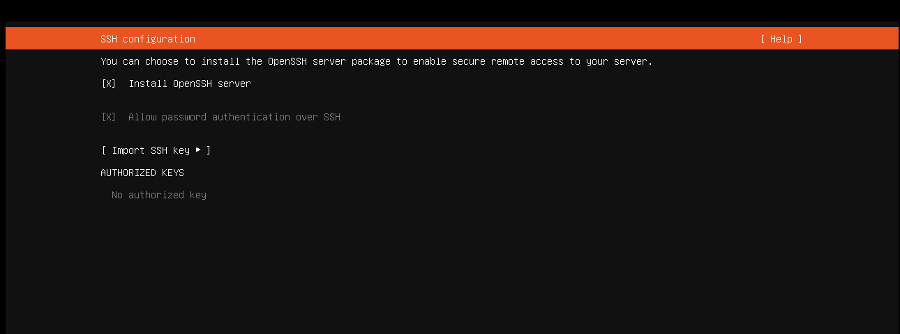

# Osa 0 - Projektin perusta

 

## Esittely

Osiossa rakensin projektille perustan eli asensin 2 virtuaalikonetta joka toinen toimi serverinä ja toinen käyttäjänä.

 

### Virtuaali serverin asennus.

Olen käyttänyt jo parissa edellisessä harjoitusprojektissa VM workstationia, joten en aijo läpikäydä sen asennusta ja käyttöä sen koommin. Halusin tähän projektiin ottaa käyttöön Linux pohjaisen Ubuntun jotta pääsen harjoittelemaan lisää Linuxin käyttöä.

Suuntasin Ubuntun omille nettisvivuille (https://ubuntu.com/download/server#how-to-install-tab-lts) Josta latasin LTS version Ubuntu serveristä. Valitsin LTS version sillä se sopii hyvin esimerkiksi pitkäaikaiseen käyttöön ja on yleensä se joka valitaan yrityskäyttöön. Kun lataus oli valmis tein virtuaalikoneen ja käynnistin ISO:n virtuaalikoneella.

Verkkoasetuksissa annoin Ubuntu Serverin hakea IP-osoitteen automaattisesti DHCP avulla. Tarkoituksena on myöhemmin määrittää palvelimelle staattinen IP-osoite, jotta GLPI-palvelimelle voidaan muodostaa yhteys aina saman osoitteen kautta. Staattinen IP helpottaa erityisesti GLPI Agentin ja muiden palveluiden määrittämistä.

Seuraavaksi asennus kysyi SSH-palvelimen konfiguroinnista. Valitsin vaihtoehdon "Install OpenSSH server", jotta Ubuntu Serveriin voidaan muodostaa myöhemmin etäyhteys SSH avulla.

Lopuksi oli mahdollista ladata "snappeja" serverille mutta en ladannut mitään. En tiennyt niistä vielä mitään ja latailen niitä projektiin tarvittaaessa myöhemmässä vaiheeessa.

Odotin Ubuntu Serverin asennuksen valmistumista ja käynnistin virtuaalikoneen uudelleen. Uudelleenkäynnistyksen yhteydessä sain virheilmoituksen **"Failed unmounting /cdrom"**.

Virheilmoitus johtui siitä, että virtuaalikone yritti edelleen käyttää asennusmediaa eli ISO-levykuvaa. Ongelman korjasin muuttamalla virtuaalikoneen asetuksia. Menin virtuaalikoneen **CD/DVD-aseman asetuksiin** ja poistin valinnan **"Connect at power on"** käytöstä.

Serveri oli nyt siis valmis joten testasimme yhteyden toimivuutta komentoriviltä. Tarkistimme ensin palvelimen oman IP-osoitteen komennolla ip addr. Tämän avulla varmistimme, että palvelin oli saanut verkosta toimivan IPv4-osoitteen.

Seuraavaksi tarkistimme oletusyhdyskäytävän komennolla ip route. Tuloksista näimme, että Ubuntu Serverilla oli määritetty default gateway, jonka kautta liikenne kulkee muualle verkkoon.

Testasimme verkkoyhteyttä myös ping-komennolla. Pingillä voidaan tarkistaa, pystyykö palvelin muodostamaan yhteyden toiseen verkossa olevaan laitteeseen. Yhteyden onnistuessa komentoriville tulee vastauksia, esimerkiksi 64 bytes from....

Testauksen perusteella Ubuntu Serverin verkkoyhteys toimi normaalisti ja palvelin pystyi kommunikoimaan verkon muiden laitteiden kanssa. Tämä varmisti, että verkkoyhteys oli kunnossa ennen GLPI:n asennuksen jatkamista.

Virtuaalikoneen asennus tapahtui viime osassa joten emme käy sen asennusta läpi. Teemme vain johtopäätöksen että kaikki onnistui halutulla tavalla. Huom: ehkä testaamista varten parempi vaihtoehto olisi jokin muu windows kuin 11 sillä sen asennus kestää tolkuttoman kauan ja se haluaa kirjautumiseen olemassa olevan mircosoft käyttäjän.
