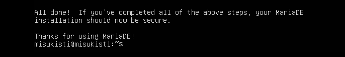

# Osa 1 - GLPI asennus Ubuntulle

 

## Esittely

Asensin GLPIä varten tarvittavat komponentit ja määrittelin ne projektin tarpeiden mukaisesti. Asennukseen kuuluivat muun muassa Ubuntu Server, Apache, PHP ja MariaDB sekä GLPI tarvitsemat asetukset ja tiedostorakenteet.

**Huom.**: Tässä osiossa on todella vähän kuvamateriaalia sillä Ubuntun serveri konsolista oli kömpelö ottaa screenshotteja.

 

### Web-palvelimmen asennus

Seuraavaksi valmistelin Ubuntu Serverin GLPI asennusta varten. Asensin palvelimelle Apache2-web-palvelimen, PHP tarvittavine lisäosineen sekä MariaDB-tietokantapalvelimen.

Apachea tarvitaan, jotta GLPIä voidaan käyttää selaimen kautta. PHP mahdollistaa GLPI toiminnan, ja sen lisäosat tarjoavat GLPI tarvitsemia ominaisuuksia, kuten yhteyden tietokantaan.

Ajoin komennon: "apt install -y apache2 php php-{apcu,cli,common,curl,gd,imap,ldap,mysql,xmlrpc,xml,mbstring,bcmath,intl,zip,redis,bz2} libapache2-mod-php php-soap php-cas" ja kaikki sujui ongelmitta.

 

### Databasen asennus ja konfigurointi

Nyt minulla oli web-palvelin mutta ei tietokanta-palvelinta. Valitsin projektiin MariaDB, joka on MySQL avoimen lähdekoodin haarautuma ja yhteensopiva MySQL kanssa. Valitsin MariaDB, koska sitä käytetään myös GLPI virallisissa asennusohjeissa. MariaDBä käytetään projektissa GLPI tietokantana, johon tallennetaan esimerkiksi käyttäjät, laitteet, tiketit ja järjestelmän asetukset.

Komennolla: "apt install -y mariadb-server" sain ladattua tietokantapalvelimen Ubuntu palvelimelleni.

Seuraavaksi oli aika konfiguroida tietokannaan perusasetuksia. Komennolla: "mysql_secure_installation" ajoin perusturvallisuuden määritystyökalun joka antoi minulle mahdollisuuden määrittää: **poista anonyymit käyttäjät**, **Poista testitietokannat** sekä **Estä root käyttäjän etäkirjautuminen**. Näillä ehdoilla tein MariaDB:n käytöstä vielä turvallisempaa.

Koska GLPI:tä voidaan käyttää eri aikavyöhykkeillä, MariaDB:lle on hyödyllistä asentaa järjestelmän aikavyöhyketiedot. Tämä tapahtuu komennolla: "mysql_tzinfo_to_sql /usr/share/zoneinfo | mysql mysql"

 

### Käyttäjän ja databasen luominen GLPIin

Määrittelyiden jälkeen kirjauduin MariaDB-tietokantapalvelimelle root-käyttäjänä komennolla mysql -uroot -pmysql. Tämän jälkeen loin GLPIä varten oman tietokannan ja tietokantakäyttäjän.
Ensin loin GLPI tietokannan komennolla: **CREATE DATABASE glpi;**

Seuraavaksi loin tietokantaan oman glpi-käyttäjän ja määritin sille salasanan: **CREATE USER 'glpi'@'localhost' IDENTIFIED BY 'yourstrongpassword';**

Tämän jälkeen annoin käyttäjälle täydet käyttöoikeudet glpi-tietokantaan: **GRANT ALL PRIVILEGES ON glpi.\* TO 'glpi'@'localhost';**

Lisäksi annoin käyttäjälle oikeuden lukea MariaDB aikavyöhyketietoja: **GRANT SELECT ON `mysql`.`time_zone_name` TO 'glpi'@'localhost';**

Lopuksi päivitin MariaDB käyttöoikeudet komennolla: **FLUSH PRIVILEGES;**

Näiden määritysten jälkeen GLPIä on oma tietokanta ja erillinen käyttäjä, jolla GLPI voi käyttää tietokantaa. Tämä on turvallisempi ratkaisu kuin käyttää GLPI yhteydessä suoraan MariaDB root-käyttäjää.

 

### GLPI:n asennus

Palvelin oli tässä vaiheessa valmis GLPI asentamista varten, joten seuraavaksi siirryimme lataamaan ja asentamaan GLPI tarvitsemat tiedostot. GLPI voi teknisesti asentaa useisiin eri sijainteihin, mutta projektissa noudatimme GLPI suosittelemaa tiedostohierarkiaa:

/etc/glpi – GLPI asetustiedostoille, kuten tietokantayhteyden määrityksille.
/var/www/html/glpi – GLPI lähdekoodille. Apache käyttää tätä hakemistoa GLPI tarjoamiseen selaimelle.
/var/lib/glpi – GLPI muuttuvalle datalle, kuten istunnoille, ladatuille tiedostoille, välimuistille, ajastetuille tehtäville ja liitännäisille.
/var/log/glpi – GLPI lokitiedostoille.

Suuntasin (cd) kansioon /var/www/html, Latasin netistä tiedoston (wget) "https://github.com/glpi-project/glpi/releases/download/11.0.8/glpi-11.0.8.tgz" (Viimeisimmän version tiedot kannattaa tarkistaa viraallisista lähteistä.) ja tiivistin tiedoston (tar) "-xvzf glpi-11.0.8.tgz.".

Loin nyt haluttuja tiedostoja hierarkiaa (vim): glpi/inc/downstream.php. Seuraavaksi määritimme GLPI uuden sijainnin asetustiedostoja varten. Tätä varten muokkasimme downstream.php-tiedostoa ja lisäsimme siihen GLPI_CONFIG_DIR-määrittelyn. Sen avulla GLPI ilmoitetaan, että asetustiedostot sijaitsevat hakemistossa /etc/glpi/

<?php define('GLPI_CONFIG_DIR', '/etc/glpi/'); if (file_exists(GLPI_CONFIG_DIR . '/local_define.php')) { require_once GLPI_CONFIG_DIR . '/local_define.php'; }

Tämän jälkeen siirsimme GLPI nykyiset hakemistot niille tarkoitettuihin sijainteihin:

mv /var/www/html/glpi/config /etc/glpi 
mv /var/www/html/glpi/files /var/lib/glpi 
mv /var/lib/glpi/_log /var/log/glpi

Näin GLPI asetukset, muuttuva data ja lokit saatiin eroteltua toisistaan. Asetukset sijaitsevat /etc/glpi-hakemistossa, muuttuvat tiedostot /var/lib/glpi-hakemistossa ja lokit /var/log/glpi-hakemistossa.

Kun GLPI uusi asetushakemisto /etc/glpi oli määritetty downstream.php-tiedostossa, siirryimme määrittämään GLPI muiden tiedostojen sijainnit. Tätä varten loimme /etc/glpi-hakemistoon uuden local_define.php-tiedoston komennolla:

vim /etc/glpi/local_define.php

Tiedostoon lisättiin GLPI tarvitsemat hakemistomääritykset. Muuttuvien tiedostojen pääsijainniksi määritettiin /var/lib/glpi ja lokitiedostojen sijainniksi /var/log/glpi.

<?php
define('GLPI_VAR_DIR', '/var/lib/glpi');
define('GLPI_DOC_DIR', GLPI_VAR_DIR);
define('GLPI_CACHE_DIR', GLPI_VAR_DIR . '/_cache');
define('GLPI_CRON_DIR', GLPI_VAR_DIR . '/_cron');
define('GLPI_GRAPH_DIR', GLPI_VAR_DIR . '/_graphs');
define('GLPI_LOCAL_I18N_DIR', GLPI_VAR_DIR . '/_locales');
define('GLPI_LOCK_DIR', GLPI_VAR_DIR . '/_lock');
define('GLPI_PICTURE_DIR', GLPI_VAR_DIR . '/_pictures');
define('GLPI_PLUGIN_DOC_DIR', GLPI_VAR_DIR . '/_plugins');
define('GLPI_RSS_DIR', GLPI_VAR_DIR . '/_rss');
define('GLPI_SESSION_DIR', GLPI_VAR_DIR . '/_sessions');
define('GLPI_TMP_DIR', GLPI_VAR_DIR . '/_tmp');
define('GLPI_UPLOAD_DIR', GLPI_VAR_DIR . '/_uploads');
define('GLPI_INVENTORY_DIR', GLPI_VAR_DIR . '/_inventories');
define('GLPI_THEMES_DIR', GLPI_VAR_DIR . '/_themes');
define('GLPI_LOG_DIR', '/var/log/glpi');

Määritysten avulla GLPI tietää, missä eri tyyppiset muuttuvat tiedostot sijaitsevat. Esimerkiksi ladatut dokumentit, istunnot, välimuisti, väliaikaiset tiedostot ja inventointitiedot tallennetaan /var/lib/glpi-hakemiston alle. Lokit puolestaan tallennetaan erikseen /var/log/glpi-hakemistoon.

Näin GLPI ohjelmakoodi, asetustiedostot, muuttuva data ja lokit pysyvät erillään toisistaan. Tämä tekee tiedostorakenteesta selkeämmän ja helpottaa myös järjestelmän ylläpitoa ja suojaamista.

 

### Tiedosto- ja kansio-oikeudet

Seuraavaksi määritin GLPI:n tiedostoille ja hakemistoille tarvittavat omistajat ja käyttöoikeudet. Näin varmistin, että Apache-palvelin pystyy käyttämään GLPI:n tarvitsemia tiedostoja ja että käyttöoikeudet ovat asianmukaiset.

Määritin GLPI:n ohjelmatiedostojen omistajaksi root-käyttäjän ja GLPI:n asetusten, muuttuvien tiedostojen sekä lokien omistajaksi www-data-käyttäjän.

Suoritin seuraavat komennot:

chown root:root /var/www/html/glpi/ -R
chown www-data:www-data /etc/glpi -R
chown www-data:www-data /var/lib/glpi -R
chown www-data:www-data /var/log/glpi -R
chown www-data:www-data /var/www/html/glpi/marketplace -Rf

find /var/www/html/glpi/ -type f -exec chmod 0644 {} \;
find /var/www/html/glpi/ -type d -exec chmod 0755 {} \;
find /etc/glpi -type f -exec chmod 0644 {} \;
find /etc/glpi -type d -exec chmod 0755 {} \;
find /var/lib/glpi -type f -exec chmod 0644 {} \;
find /var/lib/glpi -type d -exec chmod 0755 {} \;
find /var/log/glpi -type f -exec chmod 0644 {} \;
find /var/log/glpi -type d -exec chmod 0755 {} \;

chown-komennoilla määritin tiedostojen ja hakemistojen omistajat. chmod-komennoilla määritin niiden käyttöoikeudet. Tiedostoille asetin oikeudeksi 0644 ja hakemistoille 0755.

5 - Web-palvelimen määrittäminen

Seuraavaksi määritin Apache-web-palvelimen GLPI:tä varten. Luoessani VirtualHost-määrityksen pystyin ohjaamaan palvelimelle tulevat pyynnöt GLPI:n oikeaan hakemistoon.

GLPI:n VirtualHostin luominen
Loin Apachelle uuden asetustiedoston: "vim /etc/apache2/sites-available/glpi.conf"

Lisäsin tiedostoon seuraavan määrityksen:

"<VirtualHost *:80>
    ServerName yourglpi.yourdomain.com
    DocumentRoot /var/www/html/glpi/public

    <Directory /var/www/html/glpi/public>
        Require all granted

        RewriteEngine On

        RewriteCond %{HTTP:Authorization} ^(.+)$
        RewriteRule .* - [E=HTTP_AUTHORIZATION:%{HTTP:Authorization}]

        RewriteCond %{REQUEST_FILENAME} !-f
        RewriteRule ^(.*)$ index.php [QSA,L]
    </Directory>
</VirtualHost>"

ServerName-kohtaan määritin GLPI-palvelimelle käytettävän DNS-nimen. DocumentRoot määrittää hakemiston, josta Apache tarjoaa GLPI:n verkkosivuston. Tässä tapauksessa käytin hakemistoa /var/www/html/glpi/public.

Tämän jälkeen poistin Apachen oletussivuston käytöstä, otin rewrite-moduulin käyttöön ja aktivoin GLPI:tä varten luomani VirtualHostin:

a2dissite 000-default.conf
a2enmod rewrite
a2ensite glpi.conf
systemctl restart apache2

Näillä komennoilla määritin Apachen käyttämään luomaani GLPI:n VirtualHost-asetusta.

 

#### PHP:n php.ini-asetusten määrittäminen

Seuraavaksi määritin GLPI:n tarvitsemat PHP-asetukset. Avasin PHP:n asetustiedoston Vim-editorilla: "vim /etc/php/8.2/apache2/php.ini"

Muutin seuraavat asetukset:

upload_max_filesize = 20M
post_max_size = 20M
max_execution_time = 60
max_input_vars = 5000
memory_limit = 256M
session.cookie_httponly = On
date.timezone = Europe/Helsinki

Asetusten tarkoitukset ovat seuraavat:

upload_max_filesize = 20M – määritin ladattavan yksittäisen tiedoston maksimikooksi 20 megatavua.
post_max_size = 20M – määritin POST-pyynnön maksimikooksi 20 megatavua.
max_execution_time = 60 – määritin PHP-komentosarjan maksimisuoritusajaksi 60 sekuntia.
max_input_vars = 5000 – määritin käsiteltävien syötemuuttujien enimmäismääräksi 5000.
memory_limit = 256M – määritin PHP-komentosarjan käytettävissä olevan muistin enimmäismääräksi 256 megatavua.
session.cookie_httponly = On – otin käyttöön istuntoevästeiden HttpOnly-asetuksen.
date.timezone = Europe/Helsinki – määritin PHP:n aikavyöhykkeeksi Suomen aikavyöhykkeen.

 

### GLPI:n web-asennuksen aloittaminen

Kun olin asentanut ja määrittänyt GLPI:n tarvitsemat palvelut sekä tehnyt tarvittavat käyttöoikeus-, Apache- ja PHP-määritykset, pystyin aloittamaan GLPI:n varsinaisen asennuksen verkkoselaimella.

Avasin verkkoselaimen tietokoneella, jolla oli yhteys Ubuntu Serveriin, ja syötin osoiteriville GLPI-palvelimelle määrittämäni DNS-nimen.

Tämän jälkeen GLPI:n graafinen asennusohjelma avautui selaimeen, ja pystyin jatkamaan GLPI:n asennusta sekä yhdistämään sen aikaisemmin luomaani MariaDB-tietokantaan.

 
