# Osa 3 - Käytön harjoittelu

 

## Esittely

Tässä osiossa harjoittelin GLPI käyttöä ja tutustuin sen eri toimintoihin. Harjoittelun tarkoituksena oli kehittää osaamistani IT-ympäristön ylläpidossa ja erityisesti tukipyyntöjen eli tikettien käsittelyssä. Harjoittelin esimerkiksi tikettien luomista, käsittelyä ja sulkemista sekä käyttäjien ja laitteiden hallintaa GLPI avulla. Osat **Käyttäjän luominen** - **Tiketin ohjaus ryhmälle** on tehty admin käyttäjällä.

 

### Käyttäjän luominen

Halusin luoda käyttäjän joka voi kirjautua käyttäjälleen luomaan ticketin. Käyttäjä on niin sanottu Self Service käyttäjä joka pystyy GLPI portaalin kautta lähettämään tikettejä ratkottavaksi IT-tukeen.

Navigoin sivupaneelin kautta **ylläpito** tabiin ja sieltä **käyttäjät**.

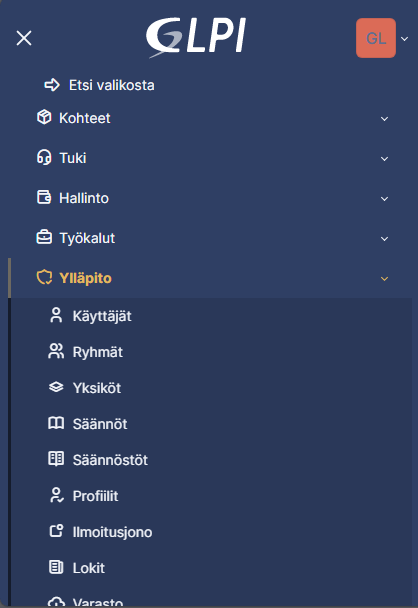

Painoin **+Lisää käyttäjä** ja täytin "Matti Meikäläisen" tiedot.

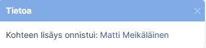

Ensimmäinen käyttäjämme oli luotu onnistuneesti!

 

Myöhempää käyttöä varten loin myös it käyttäjät it1-4.

### Laitteen liittäminen käyttäjälle

Koska tämän labin pääasiallinen tarkoitus on opetella tikettien käyttöä ja lähettämistä, en liitä käyttäjiä tässä vaiheessa laitteisiin. Tämä olisi mahdollista toteuttaa lataamalla ja asentamalla GLPI Agent, joka keräisi tietokoneesta tietoja ja lähettäisi ne GLPI-palvelimelle.

GLPI Agentilla voidaan kerätä esimerkiksi tietoja tietokoneen laitteistosta, käyttöjärjestelmästä ja asennetuista ohjelmistoista. Näiden tietojen avulla laite voidaan tuoda GLPI laitehallintaan ja yhdistää oikeaan käyttäjään.

 

### Ryhmän ja kategorian luominen

Jotta ticketit ohjautuisivat oikeaan paikkaan luomme ryhmän ja kategorioita. Näin ollen oikeat kategoriat ohjautuvat oikean ryhmän piiriin.

Menin navigointi tabista kohtaan **ylläpito** ja sieltä **ryhmä**.

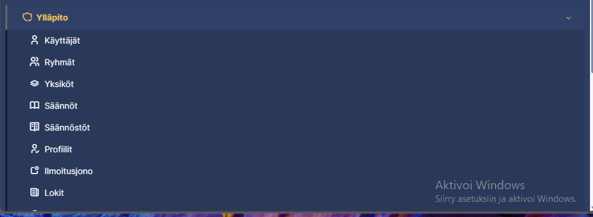

Tuttuun tapaan painoimme **+** ja lisäsimme IT-support Groupin

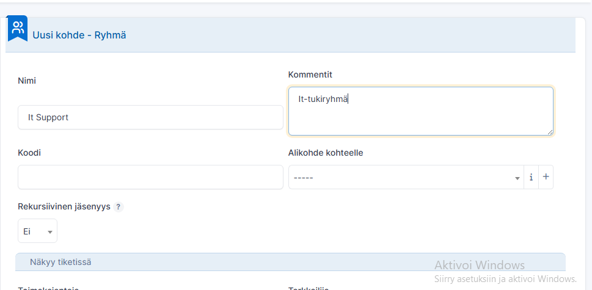

Loimme myös toisen ryhmän Software-Engineers jotka vastaavat softaan liittyvissä ongelmissa.

 

Jotta tiketit voidaan ohjata oikean ryhmän pariin loimme niiden lisäksi kategorioita. Kategorioiden luonti tapahtuu myös navigointi tabista kohdista **asetukset** ja sieltä **nimikkeet**. Uusi ikkuna aukeaa ja valitsemme **Tuki** ja **ITIL-kategoriat**.

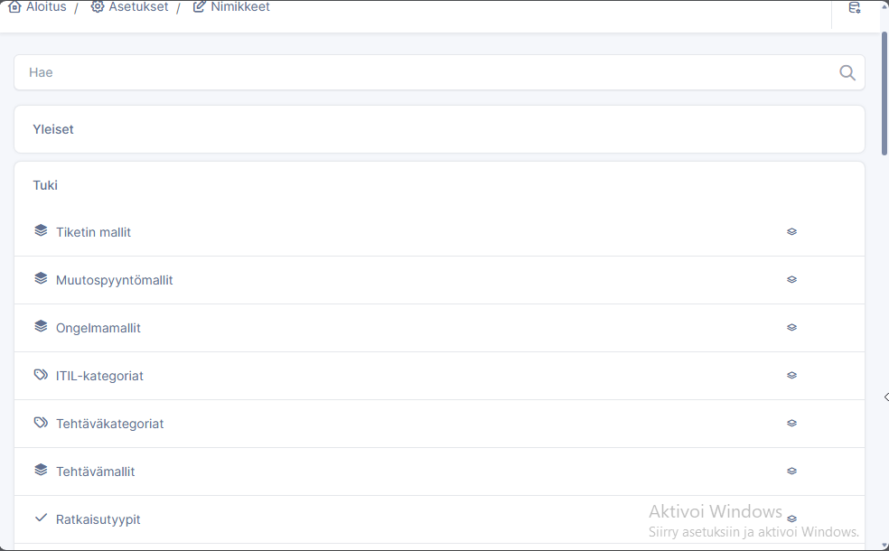

Lisäämme uuden kategorian painamalla tuttua +. Kategoria struktuurimme on 2 sivupolkua **hardware** ja **software**. Näiden alle sijoittuu sisar polkuja Hardware: PC ja printer sekä Software: Windows ja Office. Luonti vaiheessa on mahdollista antaa kategoria jollekkin ryhmälle mutta teemme sen erikseen myöhemmässä vaiheessa.

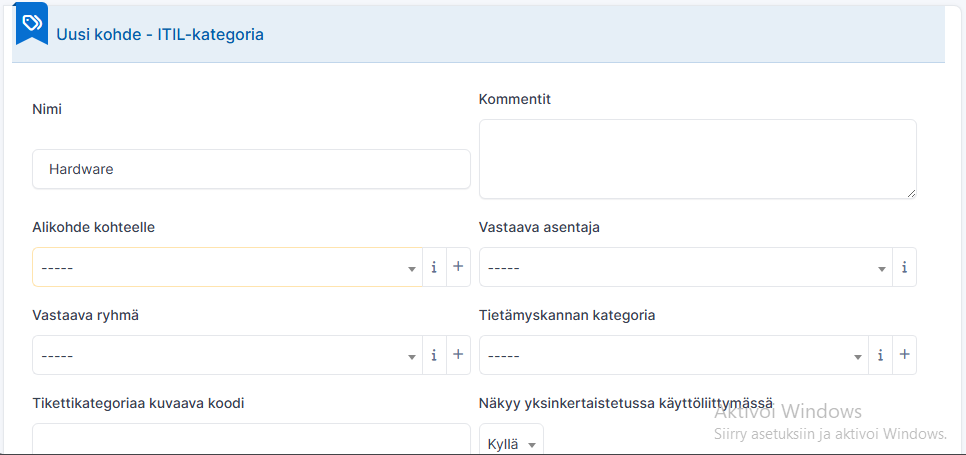

Nyt voimme luoda sisarkategorian Hardware kategoriallemme. Teemme sen samoin kun kategorian mutta valitsimme **Alikohde kohteelle** listasta Hardware kategorian.

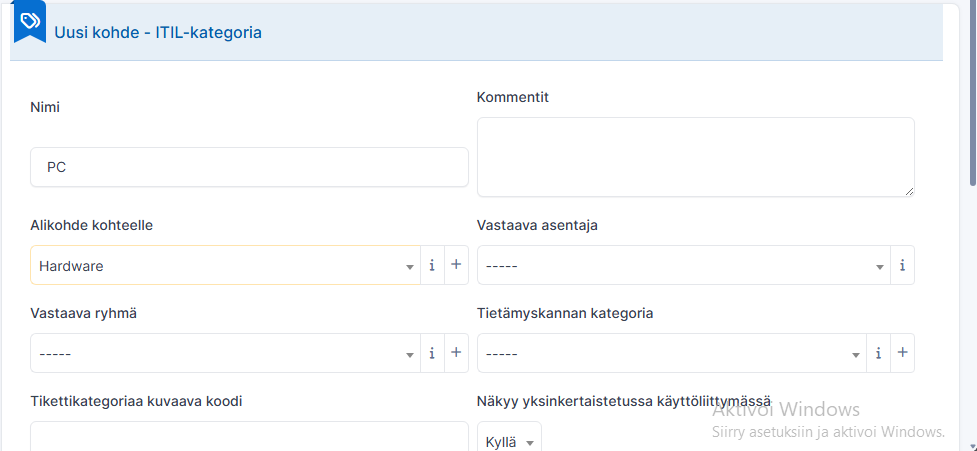

Loin samalla tekniikalla loput kategoriat ja nyt olin valmis ohjaamaan tiketit ryhmille perustustuen kategorioihin.

 

### Tiketin ohjaus ryhmälle

Navigoin ryhmänäkymään, valitsin ryhmän it-support (Luomamme ryhmä) ja navigoin sieltä **käyttäjät**. Lisäsin molemmat hardware it-tuki käyttäjät ryhmään.

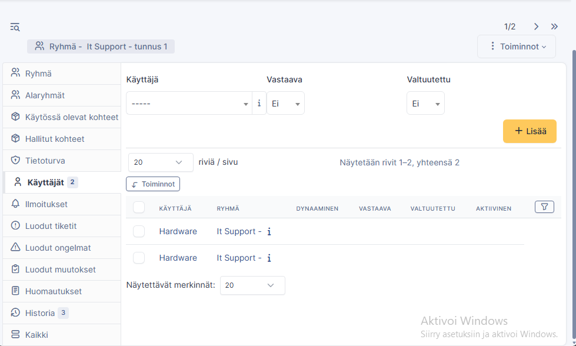

Tein saman myös software ryhmälle lisäten sitä vastaavat it-tuen.

 

Kun ryhmät olivat valmiita, lisäsin ne ITIL-kategorioihin. En määritellyt kategorioille yksittäistä henkilöä tai ryhmää oletusvastuuhenkilöksi, joten voin tikettiä käsitellessäni määrittää tarvittaessa oikean pääryhmän.

Jos kategorialle määritettäisiin tietty vastuuhenkilö tai ryhmä oletukseksi, pitäisi varmistaa, että kyseinen asentaja tai ryhmä on määritetty oikein. Näin tiketit ohjautuvat oikealle henkilölle tai ryhmälle ja vältetään mahdolliset virheet tikettien käsittelyssä.

Nyt olin asettanut oikeat ryhmät oikeaan kategoriaan ja oli aika testata rakenteen toimivuutta.

### Tiketin tekeminen ja sen ratkaisu

Kirjauduin Ensin toisella selaimella **Matti meikäläiselle** ja tein tiketin. En määritellyt kelle tiketti lähetettiin. Kategorioin vain ongelmani **PC** ja annoin lyhyen kuvauksen ongelmasta.

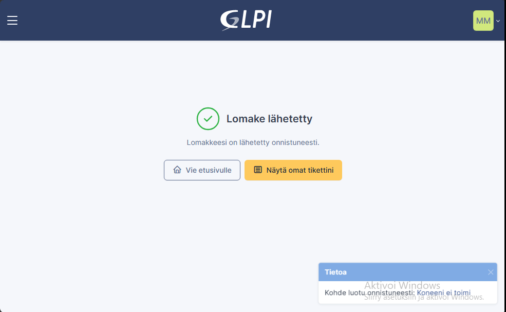

Tiketti oli saapunut ja tilassa lukee (osoitettu) mikä tarkoittaa että se on osoitettu oikealle ryhmälle.

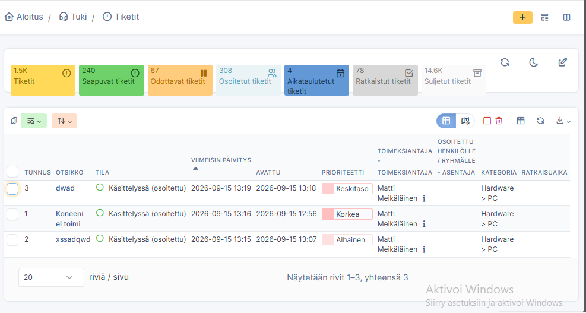

Oli aika ratkaista tiketti. Kirjauduin IT-tuki-käyttäjälle ja siirryin navigointivälilehdeltä kohtaan **Tiketit**.

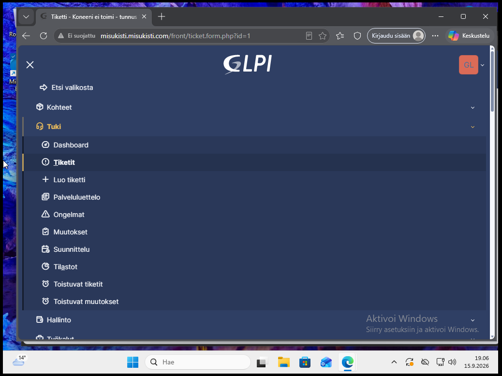

Valitsin listalta tiketin, joka oli osoitettu käyttäjälleni, ja aloitin asiakkaan ongelman selvittämisen. Vastasin tikettiin lähettämällä tarkentavan kysymyksen. Asiakkaan vastauksen jälkeen pystyin ratkaisemaan ongelman. Merkitsin tiketin ratkaistuksi alareunan valikosta valitsemalla **Lisää ratkaisu**.

Ratkaisuun voidaan lisätä erilaisia templateja, joita voidaan käyttää valmiina pohjina vastauksille. Tämä helpottaa esimerkiksi toistuvien ongelmien ratkaisemista, koska asiakkaalle voidaan lähettää valmiiksi laaditut ja kattavat ohjeet ongelman ratkaisemiseksi. Templateja voidaan hyödyntää myös tiketin etenemisen seurannassa ja esimerkiksi tilanteissa, joissa tiketti voidaan sulkea automaattisesti, jos asiakas ei vastaa määrätyn ajan kuluessa.

Tutustuin templatejen luomiseen ja käyttöön, mutta en ottanut niitä mukaan varsinaiseen harjoitukseen. Lopuksi merkitsin tiketin Ratkaistu-tilaan, jolloin se siirtyi ratkaistujen tikettien listalle.

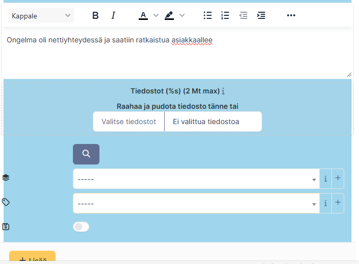

 
