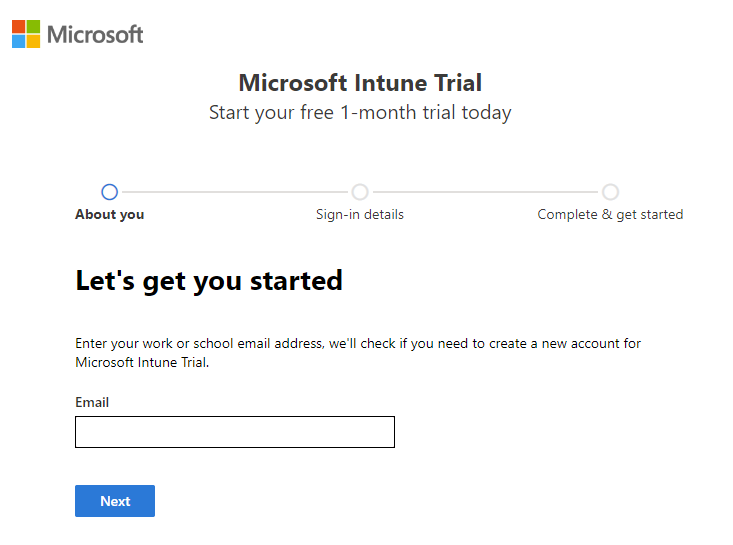
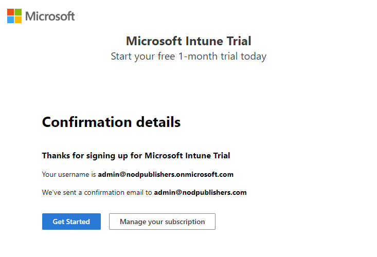

# Osa 1 - Käyttöönotto

 

## Esittely

Tässä osiossa loin projektille pohjan ja organisaation jolle voitiin tehdä myöhemmissä vaiheissa käyttäjähallintaa. Osio jäi varsin lyhyeksi sillä Entra ID:n luominen oli varsin helppoa.

 

### Käyttäjän sekä tenantin luominen projektiin

Minulla ei ole arkikäytössä tarvetta entra id:lle joten käytin ilmaisen kokeiluni tämän labin tekemiseen. Menin linkin kautta (https://signup.microsoft.com/get-started/signup?products=40be278a-dfd1-470a-9ef7-9f2596ea7ff9&bpr=1&ali=1) ilmaisen kokeilun kirjautumiseen ja lisäsin oman sähköpostini.

Täytin henkilötietoni ja käyttäjäni oli valmiina projektiin.

Yhteistietojen aikana kirjoitin myös organisaation nimen ja microsoft teki itse ilmaisen kokeilu tenantin. Projekti on siis valmis käyttäjähallintaa varten.
