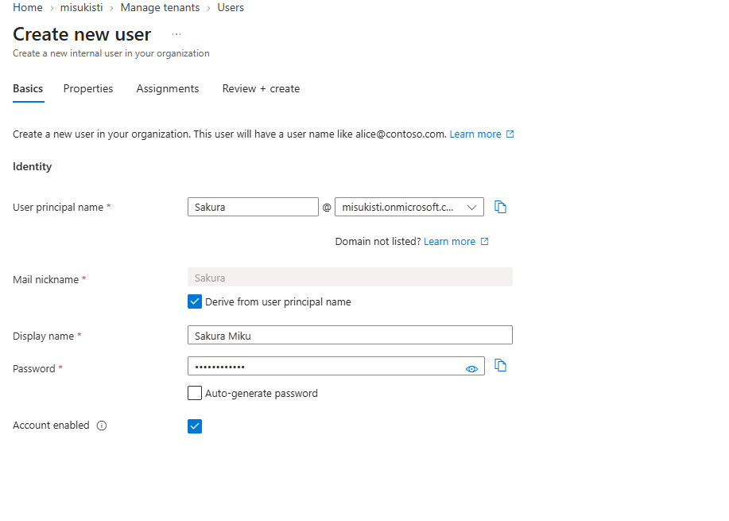
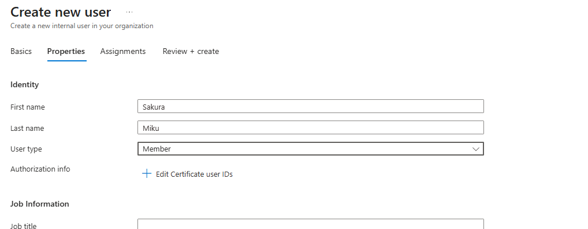
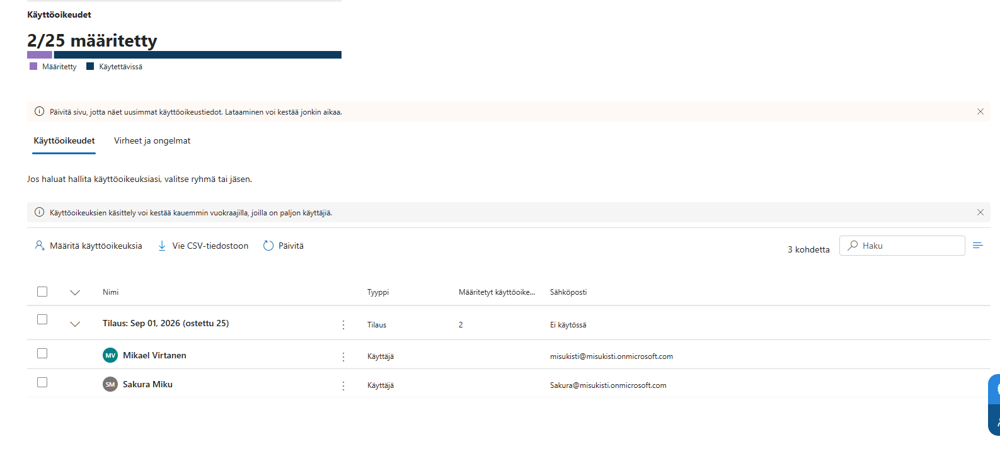
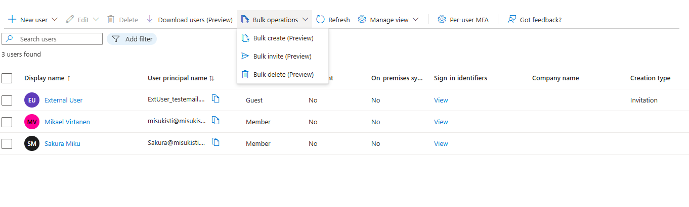
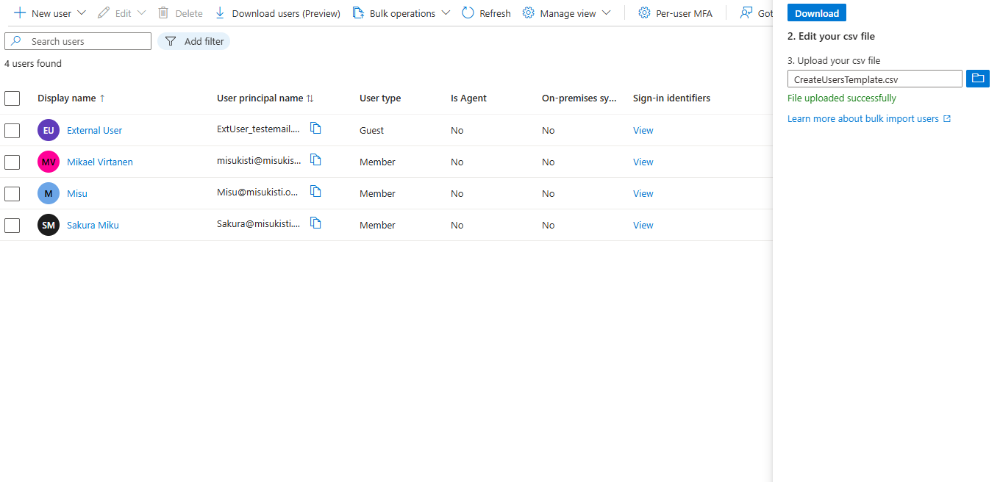

# Osa 2 - Käyttäjähallinta

 

## Esittely

Oli aika luoda ensimmäiset käyttäjät organisaatioon. Loin käyttäjiä sekä lisäsin uusia käyttäjiä ulkopuolelta projektiin. Sen lisäksi lisäsin heille rooleja ja testasin monen käyttäjän lisäämistä saman aikaisesti.

### Uuden käyttäjän luominen

Kirjauduin sisään **Microsoftin Entra Admin** paneelille ja valitsin vasemmalta valikosta **User** ja sieltä **All Users**. Sitten loin uuden käyttäjän **+ New user**. Täytin käyttäjän tiedot ja normaalista poiketen määrittelin sille itse salasanan jotta muistan sen tulevaisuutta varten. Normaalisti haluat randomgeneroida salasanan.

Seuraavassa tabissa voi syöttää käyttäjälle yksityiskohtaisesti tietoja, mutta en jaksanut harjoituksen näkökulmasta täyttää keksittyä tietoa joten valitsin nimen lisäksi **User typen**. Käytin User typena Memberiä sillä Questilla on rajoitetut oikeudet eikä istu hyvin projektiin.

testasin kirjautua uudelle käyttäjälle vanhalla virtual machinellani. Kaikki toimi kuten pitää.

### Lisenssien lisääminen käyttäjille

Halusin nyt uudelle käyttäjälle oikeudet Microsoft Intune pakettiin joka kuuluu osaksi trialia. Navigoin taas vasemmassa paneelissa kohtaan **Laskutus** ja sieltä valitsin **käyttöoikeudet**. Valitsin haluamani lisenssin ja sieltä **määritä käyttöoikeuksia**. Hain listasta lisäämäni käyttäjän ja lisäsin sen käyttöoikeuksien listaan.

### Käyttäjän lisääminen ulkopuolelta

Navigoitiin taas vasemmalla paneelilla tuttuun kohtaan **User** ja sieltä **All Users**. Sitten loin uuden käyttäjän **+ New user** mutta tällä kertaa valitsin kohdan **Invite external user**. Nyt syötin sille tiedot Email: ExtUser@testemail.com ja Display name: External User.

Nyt listassamme komeilee 3 uutta käyttäjää:

### Monen käyttäjän lisääminen samanaikaisesti

Loin Microsoft Entra ID -ympäristöön uuden käyttäjän bulk import -toiminnolla. Tätä varten latasin Entra ID tarjoaman CSV-mallipohjan User tabista ja täytin siihen käyttäjän perustiedot, kuten nimen, käyttäjätunnuksen, salasanan, etunimen, sukunimen, tehtävänimikkeen ja osaston.

Nyt CSV muokkausten jälkeen listassa lymyilee uusi käyttäjä Misu. Näin voimme luoda liudan uusia käyttäjiä yhdellä toiminnolla.

