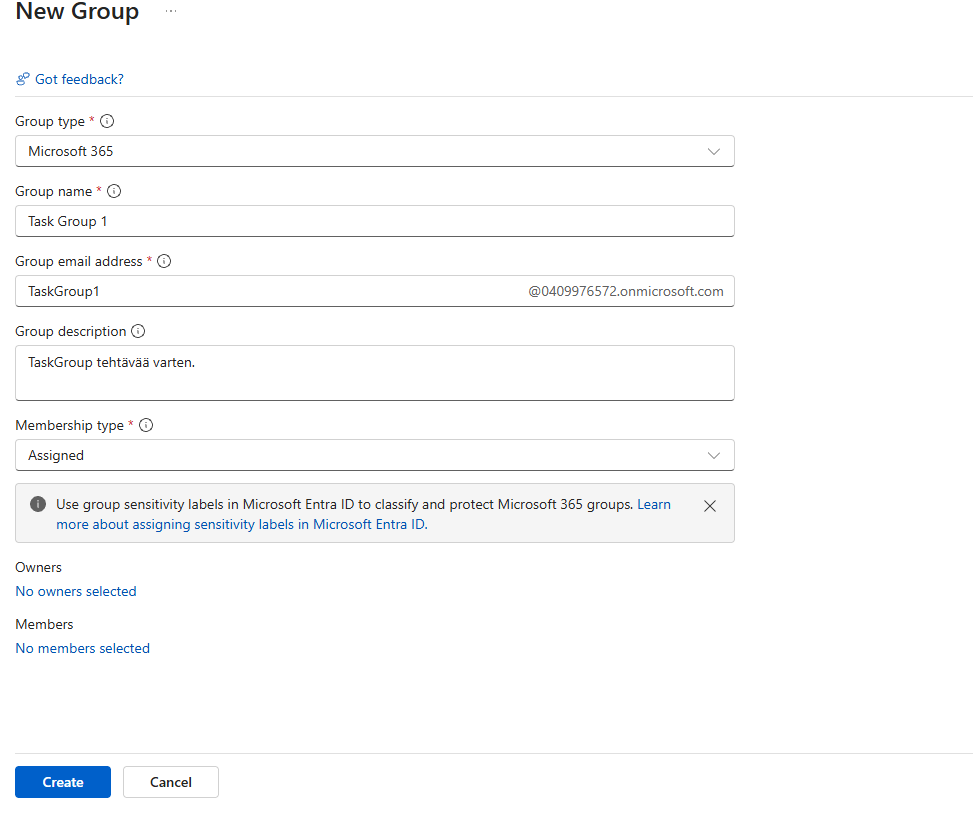
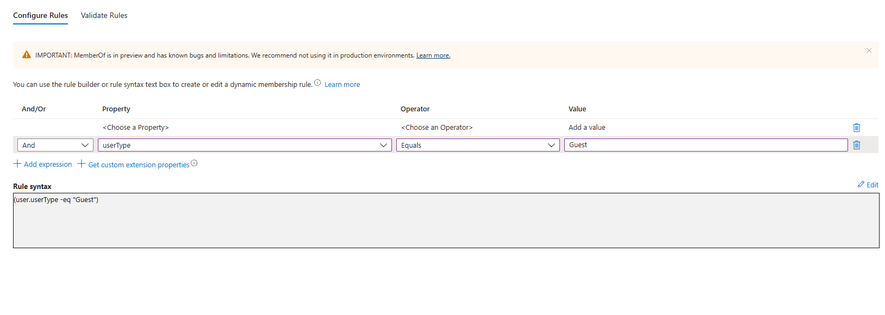
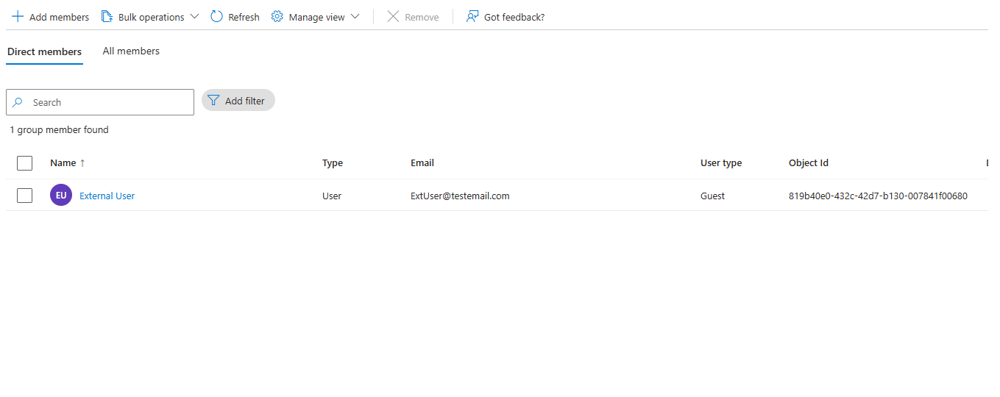
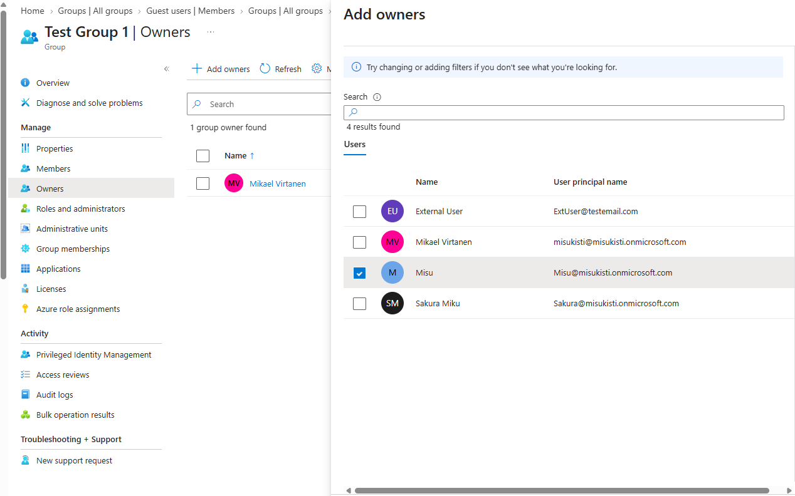
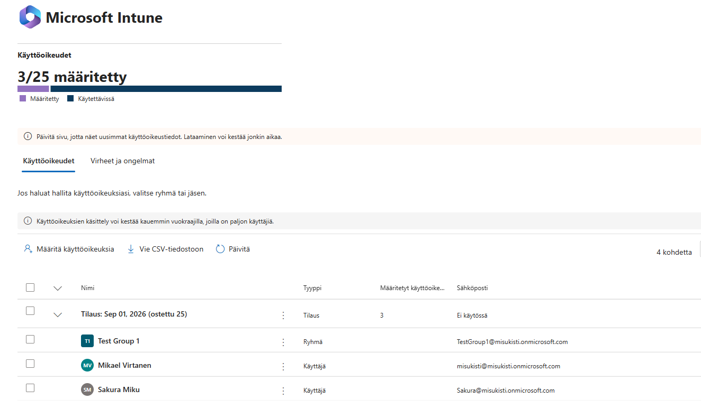

# Osa 3 - Ryhmien luominen

 

## Esittely

Tässä osiossa loin ryhmiä ja annoin ryhmille eri lisensseejä ja oikeuksia.

### Ryhmän luominen

Kirjauduin **Entra Id admin centeeriin** ja navigoin vasemmalta tutusta valikosta kohtaan **groups**. Sieltä valitsin **New group**.

Myöhemmässä vaiheessa määrittelen projektille security groupin joten nyt keskityin toiseen vaihtoehtoon eli **Microsoft 365** ryhmään. Microsoft 365 ryhmät ovat tarkoitettu enemmän yhteistyöryhmiksi johon liitetään Microsoft 365 -palveluita kun taas security ryhmät käsittelevät syvemmin käyttöoikeuksia.

Täytin haluamani tiedot ja painoin **create**. Nyt minulla oli ryhmä mutta ei jäseniä. Päätin lisätä Sakura jäsenen jonka olin luonut projektiin aikaisemmassa vaiheessa. Member näkymässä painoin **+ add new member** ja lisäsin Sakuran ryhmään. Ryhmään voidaan lisäsä tekovaiheessa käyttäjiä ja omistajia, mikä on suositeltumpi tapa.

 

### Security ryhmän luominen

Olin tyytyväinen ryhmään ja halusin nyt testata **security ryhmän** luomista. Halusin luoda vieraskäyttäjille ryhmän, joten suuntasin samaan add group näkymään kuin edellisessä ja vaihdoin microsoft 365 tyypin **security group** -tyypiksi ja täytin loput tiedot. Ennen ryhmän luomista muutin membership tyyppiä **Dynamic Useriksi** ja tein siihen oman "queryn" käyttämällä **add dymaic query toimintoa**. Käytin "propertyna" käyttäjätyyppiä (userType), operaattorina yhtäkuin (Equals) ja arvona (Value) Guest. Näin ollen syntaxina luki jotakuinkin valitse kaikki vierasta vastaavat luokat. (user.userType -eq "Guest")

Kaikki toimi kuin pitää ja external User jonka rooli on Guest ilmestyy ryhmään päivittämisen jälkee.

 

### Lisenssien ja omistajien lisääminen ryhmille.

Jotta voimme lisätä omistajia ryhmille meidän tulee navigoida samaan näkymään kuin uusien käyttäjien lisääminen ryhmään. Tällä kertaa valitsimme kuitenkin **owners** tabin emmekä **members** tabia. Tuttuun tapaan valitsimme **+ Add Owner**. Valitsimme listasta "Misu" käyttäjän ja teimmee hänestä omistajan ryhmään. **Huomiona:** Jos ryhmälle ei määritetä omistajaa, tenantin järjestelmänvalvoja lisätään automaattisesti ryhmän omistajaksi.

Lisätään testiryhmälle nyt lisenssi. Avasin uuteen välilehteen **Microsoft 365 admin centerin** ja sieltä vasemmmasta valikosta käyttöoikeudet laskutus osiosta. Käyttöoikeuksista valitsin lisenssin, jonka halusin määritellä ja sitten "**määrittele käyttöoikeuksia**". Pystyin valitsemaan ryhmiä, sekä käyttäjiä samalla tavalla kuin yksittäisen käyttäjän lisenssien määrittelyssä. Prosessi on siis lähes sama, listasta valittiin nyt vain ryhmä yksittäisen käyttäjän sijaan. Valitsin Test Group 1 jonka loin aikaisemmmin. Nyt listaan oli ilmestynyt valitsemani ryhmä.

 
