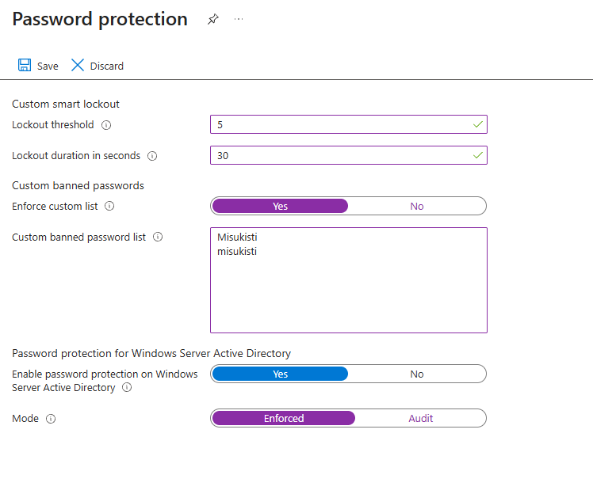
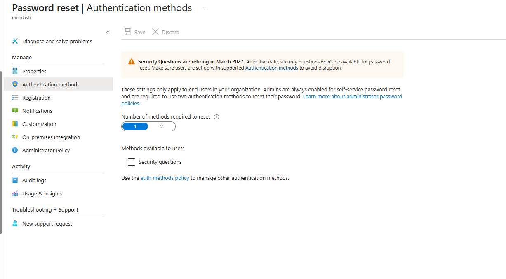
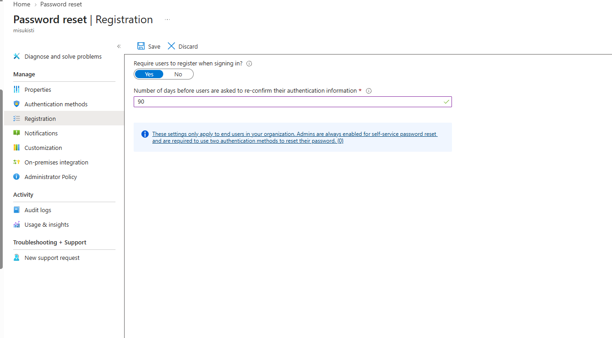
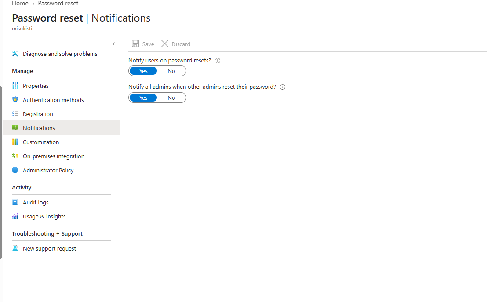
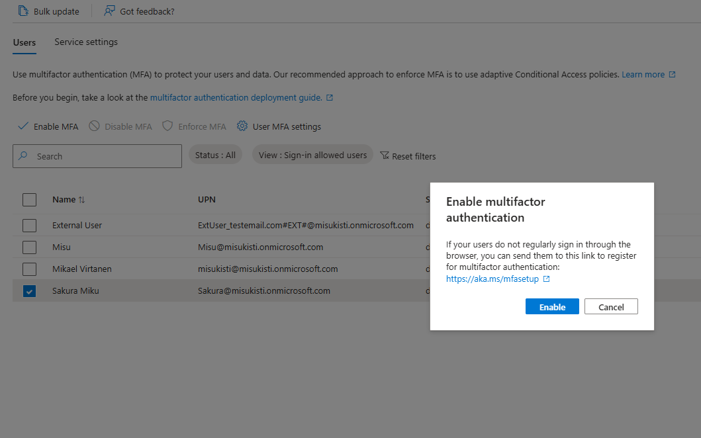
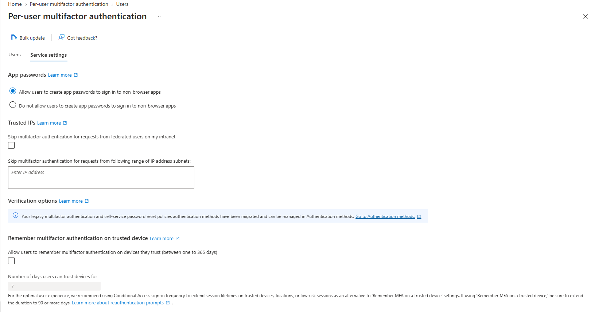
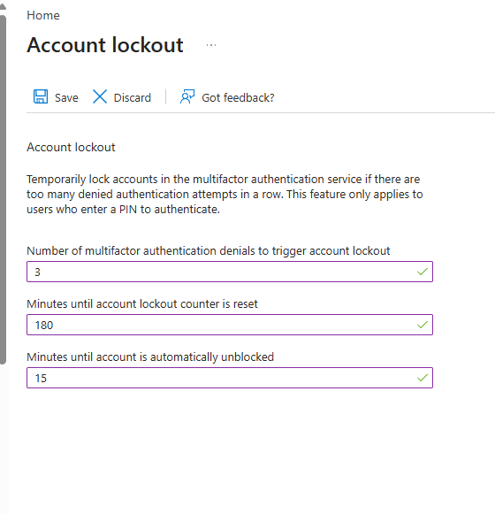
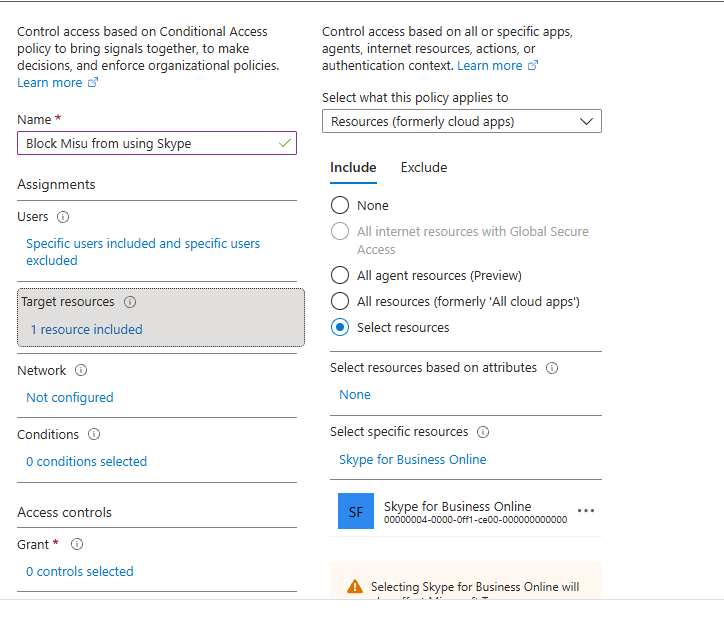
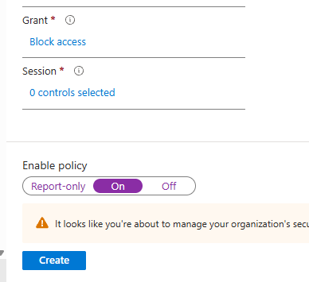
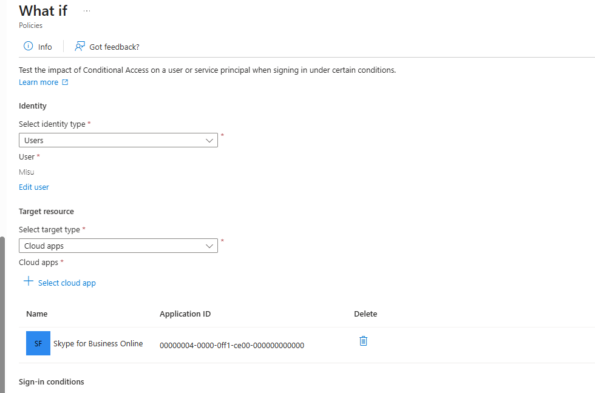

# Osa 4 - Erilaisia taskeja

 

## Esittely

Suoritin tässä osiossa erilaisia taskeja liittyen Entra ID:n toimintaan.

 

### Salasanojen suojaus

Organisaatiossa on tärkeää huolehtia siitä, että käyttäjillä on riittävän vahvat ja turvalliset salasanat. Vahvat salasanat auttavat estämään luvattoman pääsyn käyttäjätileille ja suojaavat organisaation tietoja. Siksi teimme pieniä muutoksia niiden määrittelylle. Kirjauduin **Microsoft Entra admin centeriin** ja navigoin taas tuttuun ja turvalliseen sivupaneeliin. Sieltä **Protection** ja submenusta **Authentication methods**. Valitsin **Password protectionin** ja lähdin täyttämään haluttuja arvoja.

**Huomio:** Käytän lähteenäni microsoftin learn moduulia ja kun yritin itse navigoida protection tabiin en löytänyt sitä sivumenusta. Kirjoitin hakuun Password protection ja löysin etsimäni.

Annoin käyttäjille 5 yritystä ja 30s lukon kun 5 yritystä saavutetaan. Tämä hidastaa force hyökkäyksiä käyttäjille. Kokeilin myös mukautettua salasana listaa joka estää tiettyjen salasanojen käytön. Siihen kannattaa laittaa kaikki yritykseen liittyvät nimet jotka olisi helppo arvata tai kokeilla ulkopuolisen toimesta.

Sain valmiiksi salasana määrittelyn ja kaikki toimi kuten pitää.

 

### Self-Service Password Reset (SSPR) -toiminnon perustehtäviä

Halusin että käyttäjällä on mahdollisuus salasanan palauttamiseen sen jälkeen kun: ei muista salasanaa, tili on lukkioutunut tai haluaa vaihtaa salasanaansa.

Näin ollen navigoin vasemmasta paneelista kohtaan **password reset**. Valitsin **Self service password enabled** valitsimesta kohdan selected jotta valitsemallani groupilla on mahdollisuus salasanan palauttamiseen. **No group selected** kohdasta valitsin kohde ryhmän jolle halusin asetuksen ja nyt tallensin määrittelyn.

Sitteen vähän SSPR asetuksiin. Suuntasin Authentication methods tabiin ja valitsin sieltä **Numbeer of methods required reset: 1**. Tämä tarkoittaa sitä kun käyttäjä palauttaa salasanansa SSPR:n avulla, hänen täytyy käyttää yhtä tunnistautumismenetelmää henkilöllisyytensä vahvistamiseen. Esimerkiksi: Microsoft authentication tai puhelinnumero/tekstiviesti. **Auth methods policysta** voi määritellä tarkemmat palauttamiseen halutus menetelmät.

Seuraavassa tabissa määrittelin että käyttäjän pitää rekisteröityä kirjautuakseen. Tämä tarkoittaa että käyttäjän tulee kirjautua authentication appiin kirjautukseen ja asettaa se kirjautumismetodikseen. Muutin myös uudelleentunnistautumisen aikarajaa 180 päivästä 90 päivään, jolloin käyttäjältä kysytään uudelleen tunnistautumista 90 päivän välein.

Viimeisempänä asetin ilmoitukset salasanan vaihdoista. Siirryin **Notification** tabiin ja valitsin sieltä että ilmoitus salasanan vaihdosta tulee minulle sekä käyttäjälle. Organisaationi on varsin pieni joten ilmoitus adminille ei tuota liikaa stressiä tai vaivaa.

 

### Monivaiheisen tunnistautumisen määrittäminen

Tässä harjoituksessa tutustuin MFA:n (monivaiheisen tunnistautumisen) käyttöönottoon ja määritin perusmuotoisen MFA-ratkaisun.

Kirjauduin jo tuttuun admin centeriin. Navigoin vasemmalta kohtaan **User** ja **All Users**. Yläpalkissa löysin kohdan **Per-user MFA** monivaiheisen tunnistautumisen määrittelyyn. Määrittelin yhdelle käyttäjälle (Sakura) monivaiheisen tunnistautumisen. Lista päivittyy pian ja määritellyn kohdalla lukee **enforced**

Tarkastelin nyt MFA-palvelun asetuksia. Suuntasin takaisin kohtaan **All Users** sieltä **Per-user MFA** ja **Service settings**. Pidin itse asetukset sellaisenaan mutta halutessaan määrittelyä pystyy muuttamaan ja ottamaan käyttöön **Save** toiminnolla.

Lopuksi halusin säätää lukitusasetuksia tilanteeseen, jossa käyttäjä yrittää kirjautua liian monta kertaa väärin. Menin **Protection**-alavalikkoon, selasin sivun loppuun ja valitsin **Show more**. Tämän jälkeen valitsin **Multifactor authentication**, josta löytyi **Account lockout** -valikko.

Määritin asetuksiksi kolme sallittua MFA-yritystä, lukitusyritysten laskurin nollautumisajaksi 180 sekuntia sekä lukituksen kestoksi 15 minuuttia. Näin käyttäjätili lukittuu hetkellisesti, jos MFA-tunnistautumista yritetään liian monta kertaa väärin.

Tutustuin myös MFA:n muihin määritysasetuksiin, kuten **Fraud alert**-, **Block/Unblock users**- ja **Notifications**-toimintoihin.

 

### ehdollisten käyttöoikeuksien (Conditional Access) määrittäminen ja hallinta

Viimeisenä tehtävänä määrittelin ehdollisia käyttöoikeuksia käyttäjille.

Homma hoidettiin taas Entran admin centerissä jossa suuntasin **Conditional access** kohtaan jotta päästiin määrittelemään ehdollisia käyttöoikeuksia.

Tein ekan käyttöoikeuden (policy) kohdassa **+ Create new policy** . Halusin estää käyttäjää Misu käyttämästä Skypeä. **User** kohdassa valitsin **Users and groups** ja **include** tabista **select users and groups**. Eteen avautuu lista ryhmistä ja käyttäjistä josta valitsin Misu käyttäjän. Nyt **Exclude** tabista valitsin admin käyttäjäni jotta se ei jäisi vahingossakaan policyn jalkoihin kun sen asetuksia muutettaisiin.

Seuraavaksi suuntasin Target tabiin josta voin blockata yksittäisiä sovelluksia. Valitsin **Resources (formerly cloud apps)**, include tabista **select resource** ja nyt **specific resourcesta** Skype.

Tutustuin kohtiin **Network** ja **Conditions** mutta en ottanut niistä mitään käyttöön tässä projektissa. Suuntasin sitten **Access Controls** ja **Grant**. Valitsin asetuksista **Block**access joka estää käyttämmästä sovellusta kaikissa tilanteissa. Lopuksi selasin sivun loppuun ja hyväksyin policyn ja painoin **create**.

Testasimme luodun policyn toimintaa **What If** -toiminnolla. Siirryin takaisin **Conditional Access** -valikkoon ja avasin **Policies**-välilehden. Tämän jälkeen valitsin **What If** -toiminnon.

**Identity**-kohdassa valitsin **Users** ja käyttäjäksi Misun. **Target Resources** -kohdassa valitsin **Cloud Apps** ja sovellukseksi **Skype**. Lopuksi painoin **What If**, jolloin näimme, miten luotu policy vaikuttaisi kyseisen käyttäjän kirjautumiseen.

