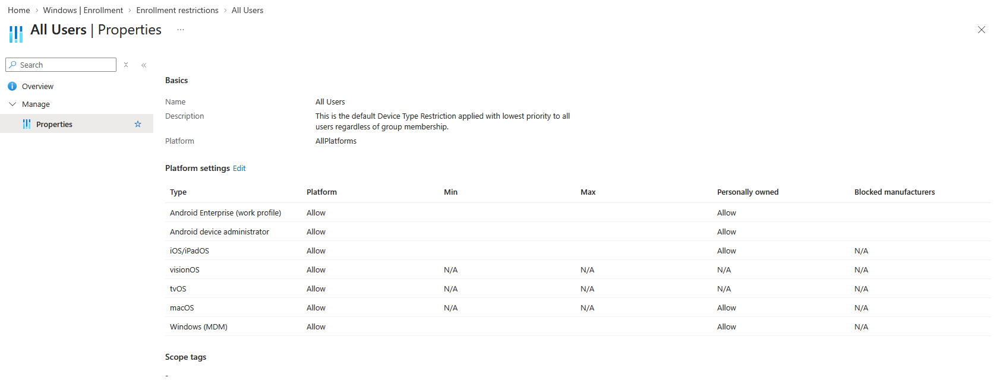
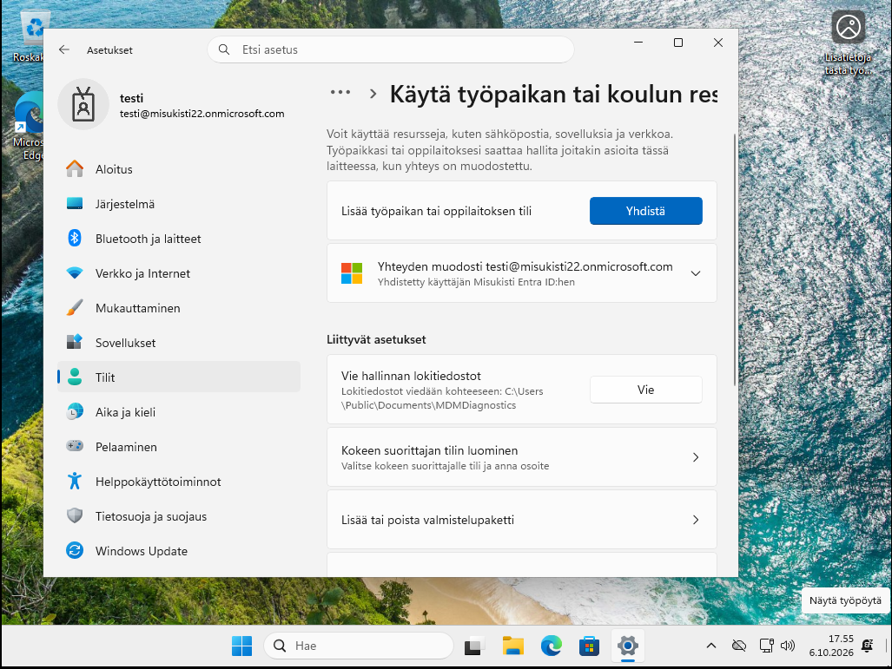
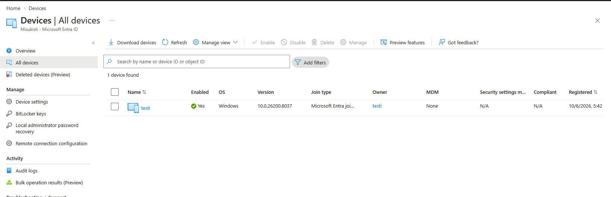

# Osa 1 - käyttöönotto ja laitteiden rekisteröinti

 

## Esittely

Tässä osiossa loin projektille pohjan, Intune-testiympäristö sekä lisäsin käyttäjiä ympäristöön. En käsittele tässä osiossa virtuaalikoneiden luomista tai ilmaisen Intune-kokeilun käyttöönottoa tarkemmin. Microsoftin viralliset ohjeet ilmaisen kokeilun aloittamiseen löytyvät alla olevasta linkistä.

Microsoft Intune – ilmaisen kokeilun käyttöönotto

 

### Laitteen lisäämiseen liittyvät asetukset

Ennen kuin lisäsin laitteita Intune-projektiini, halusin määrittää, kuinka monta laitetta ympäristöön voidaan liittää ja millaiset laitteet voivat liittyä projektiin. Tällä tavalla pystyin rajoittamaan ympäristöön hyväksyttäviä laitteita ja hallitsemaan paremmin, mitä laitteita Intune voi hallita.

Siirryin Intune-hallintakeskuksessa kohtaan **Devices → Enrollment → Device platform restrictions**. Täällä pystyin määrittämään, mitä käyttöjärjestelmiä käyttävät laitteet voidaan rekisteröidä Intuneen. Avasin All Users -kohdan ja valitsin Properties, jonka jälkeen pystyin muokkaamaan käyttöjärjestelmäkohtaisia asetuksia. Tässä projektissa sallin Windows-laitteiden rekisteröinnin myös kotilaitteesta jotta sain yhdistettyä vaivattomasti oman virtuaalikoneen.

Seuraavaksi määritin käyttäjän sallittujen laitteiden enimmäismäärän. Siirryin kohtaan Devices → Enrollment → Device limit restrictions. Täällä pystyin määrittämään, kuinka monta laitetta yksittäinen käyttäjä voi rekisteröidä Intuneen. Avasin käytössä olevan rajoituksen ja valitsin Properties, jonka jälkeen määritin halutun laitemäärän kohdasta Device limit.

Näiden asetusten avulla pystyin rajoittamaan sekä käyttäjän rekisteröimien laitteiden määrää että sitä, millä käyttöjärjestelmillä varustettuja laitteita Intune-ympäristöön voidaan liittää.

### Käyttäjän lisääminen

Kirjauduin Entra ID -hallintapaneeliin ja loin Entra ID:stä tutun labran tapaan uuden käyttäjän (Voi käydä kertaamassa Microsoft Entra ID - Osa 2). Tämän jälkeen pystyin kirjautumaan virtuaalikoneella kyseisellä käyttäjällä domainiin ja lisääminen tapahtui automaattisesti Intunesiin. HUOM: jos käyttäjältä puuttuu lisenssi sitä ei yhdistetä automaattisesti Intunesiin. Sen lisäksi MDM asetukset pitää olla kunnossa jotta automaattinen yhdistäminen onnistuu.

Tämä on "Yrityksen" omistama kone joka tarkoittaa että se on onnistuneesti lisätty entra ID:hen:

Tarkistin koneen myös Entra sekä Intunes hallintapaneelista jossa navigoin valikkoon kohtaan **Devices** ja sieltä **All devices**. Sinne oli ilmestynyt uusi laite.

